# Introdución

En este documento se abordará el análisis y preprocesamiento de la base
de datos **Credit Approval**, con el propósito de entrenar y evaluar
modelos clasificadores que permitan realizar predicciones precisas y
confiables. El análisis comenzará con la carga de los datos, seguido de
una exploración detallada de las variables, incluyendo su distribución,
características principales y posibles inconsistencias o valores
atípicos.

Posteriormente, se llevarán a cabo las transformaciones necesarias para
optimizar la calidad de los datos y mejorar su capacidad predictiva.
Estas transformaciones incluirán la normalización, la eliminación de
valores faltantes, la corrección de sesgos en las variables y la
selección de características relevantes, asegurando así un conjunto de
datos limpio y adecuado para los modelos.

A continuación, se entrenarán y evaluarán cuatro modelos clasificadores:
**Random Forest**, **Redes Neuronales Artificiales** (nnet), **Gradient
Boosting Machines** (GBM) y **K-Nearest Neighbors** (k-NN). Se realizará
un ajuste de hiperparámetros para ciertos modelos con el fin de
maximizar su rendimiento, seguido de una comparación exhaustiva de los
resultados obtenidos. Finalmente, se seleccionará el modelo que
demuestre la mejor capacidad de generalización, equilibrando precisión,
robustez y consistencia, proporcionando una solución óptima para la
clasificación de futuros datos.

## Carga de librerías necesarias.


``` r
suppressWarnings({ # Para no manchar la salida.
library(ggplot2)
library(dplyr)
library(GGally)
library(caret)
library(RANN)
library(e1071)
library(randomForest)
library(nnet)
})
```

```
## 
## Adjuntando el paquete: 'dplyr'
```

```
## The following objects are masked from 'package:stats':
## 
##     filter, lag
```

```
## The following objects are masked from 'package:base':
## 
##     intersect, setdiff, setequal, union
```

```
## Registered S3 method overwritten by 'GGally':
##   method from   
##   +.gg   ggplot2
```

```
## Cargando paquete requerido: lattice
```

```
## randomForest 4.7-1.2
```

```
## Type rfNews() to see new features/changes/bug fixes.
```

```
## 
## Adjuntando el paquete: 'randomForest'
```

```
## The following object is masked from 'package:dplyr':
## 
##     combine
```

```
## The following object is masked from 'package:ggplot2':
## 
##     margin
```

## Carga de la base de datos

Para comenzar, cargamos la base de datos, guardando en distintas
variables los datos que utilizaremos para el entrenamiento y para probar
el modelo. Añadimos la opción "na.strings=?" para sustituir los valores
desconocidos por NA y poder ser procesados posteriormente.


``` r
credit = read.table("crx.data", sep = ",",na.strings = "?")
```

# Preprocesado de datos(I): Tratamiento inicial de la BBDD

Primero tenemos que analizar que variables contiene la base de datos:


``` r
head(credit)
```

```
##   V1    V2    V3 V4 V5 V6 V7   V8 V9 V10 V11 V12 V13 V14 V15 V16
## 1  b 30.83 0.000  u  g  w  v 1.25  t   t   1   f   g 202   0   +
## 2  a 58.67 4.460  u  g  q  h 3.04  t   t   6   f   g  43 560   +
## 3  a 24.50 0.500  u  g  q  h 1.50  t   f   0   f   g 280 824   +
## 4  b 27.83 1.540  u  g  w  v 3.75  t   t   5   t   g 100   3   +
## 5  b 20.17 5.625  u  g  w  v 1.71  t   f   0   f   s 120   0   +
## 6  b 32.08 4.000  u  g  m  v 2.50  t   f   0   t   g 360   0   +
```

Observamos al importar la base de datos el tipo de datos de las
variables es incorrecto.

Procedemos a transformar el tipo de dato de las variables tal y como se
especifica en la documentación de la base de datos.


``` r
credit["V1"] = lapply(credit["V1"], FUN = as.factor)
credit["V2"] = lapply(credit["V2"], FUN = as.numeric)
credit["V3"] = lapply(credit["V3"], FUN = as.numeric)
credit["V4"] = lapply(credit["V4"], FUN = as.factor)
credit["V5"] = lapply(credit["V5"], FUN = as.factor)
credit["V6"] = lapply(credit["V6"], FUN = as.factor)
credit["V7"] = lapply(credit["V7"], FUN = as.factor)
credit["V8"] = lapply(credit["V8"], FUN = as.numeric)
credit["V9"] = lapply(credit["V9"], FUN = as.factor)
credit["V10"] = lapply(credit["V10"], FUN = as.factor)
credit["V11"] = lapply(credit["V11"], FUN = as.numeric)
credit["V12"] = lapply(credit["V12"], FUN = as.factor)
credit["V13"] = lapply(credit["V13"], FUN = as.factor)
credit["V14"] = lapply(credit["V14"], FUN = as.numeric)
credit["V15"] = lapply(credit["V15"], FUN = as.numeric)
credit["V16"] = lapply(credit["V16"], FUN = as.factor)
head(credit)
```

```
##   V1    V2    V3 V4 V5 V6 V7   V8 V9 V10 V11 V12 V13 V14 V15 V16
## 1  b 30.83 0.000  u  g  w  v 1.25  t   t   1   f   g 202   0   +
## 2  a 58.67 4.460  u  g  q  h 3.04  t   t   6   f   g  43 560   +
## 3  a 24.50 0.500  u  g  q  h 1.50  t   f   0   f   g 280 824   +
## 4  b 27.83 1.540  u  g  w  v 3.75  t   t   5   t   g 100   3   +
## 5  b 20.17 5.625  u  g  w  v 1.71  t   f   0   f   s 120   0   +
## 6  b 32.08 4.000  u  g  m  v 2.50  t   f   0   t   g 360   0   +
```

Ahora observamos que la variable V4 solo tiene 3 niveles y debería de
tener 4, es decir, hay algún valor que nunca aparece en los datos.
Viendo en la descripción de la BBDD podemos ver que debería aparecer el
valor "t". Lo añadimos:


``` r
levels(credit$V4)<-c(levels(credit$V4),"t")
head(credit$V4)
```

```
## [1] u u u u u u
## Levels: l u y t
```

``` r
head(credit)
```

```
##   V1    V2    V3 V4 V5 V6 V7   V8 V9 V10 V11 V12 V13 V14 V15 V16
## 1  b 30.83 0.000  u  g  w  v 1.25  t   t   1   f   g 202   0   +
## 2  a 58.67 4.460  u  g  q  h 3.04  t   t   6   f   g  43 560   +
## 3  a 24.50 0.500  u  g  q  h 1.50  t   f   0   f   g 280 824   +
## 4  b 27.83 1.540  u  g  w  v 3.75  t   t   5   t   g 100   3   +
## 5  b 20.17 5.625  u  g  w  v 1.71  t   f   0   f   s 120   0   +
## 6  b 32.08 4.000  u  g  m  v 2.50  t   f   0   t   g 360   0   +
```

Una vez corregido el tipos de datos y añadido las categorías faltantes
nos queda la siguiente:


``` r
summary(credit)
```

```
##     V1            V2              V3            V4         V5     
##  a   :210   Min.   :13.75   Min.   : 0.000   l   :  2   g   :519  
##  b   :468   1st Qu.:22.60   1st Qu.: 1.000   u   :519   gg  :  2  
##  NA's: 12   Median :28.46   Median : 2.750   y   :163   p   :163  
##             Mean   :31.57   Mean   : 4.759   t   :  0   NA's:  6  
##             3rd Qu.:38.23   3rd Qu.: 7.207   NA's:  6             
##             Max.   :80.25   Max.   :28.000                        
##             NA's   :12                                            
##        V6            V7            V8         V9      V10          V11      
##  c      :137   v      :399   Min.   : 0.000   f:329   f:395   Min.   : 0.0  
##  q      : 78   h      :138   1st Qu.: 0.165   t:361   t:295   1st Qu.: 0.0  
##  w      : 64   bb     : 59   Median : 1.000                   Median : 0.0  
##  i      : 59   ff     : 57   Mean   : 2.223                   Mean   : 2.4  
##  aa     : 54   j      :  8   3rd Qu.: 2.625                   3rd Qu.: 3.0  
##  (Other):289   (Other): 20   Max.   :28.500                   Max.   :67.0  
##  NA's   :  9   NA's   :  9                                                  
##  V12     V13          V14            V15           V16    
##  f:374   g:625   Min.   :   0   Min.   :     0.0   -:383  
##  t:316   p:  8   1st Qu.:  75   1st Qu.:     0.0   +:307  
##          s: 57   Median : 160   Median :     5.0          
##                  Mean   : 184   Mean   :  1017.4          
##                  3rd Qu.: 276   3rd Qu.:   395.5          
##                  Max.   :2000   Max.   :100000.0          
##                  NA's   :13
```

``` r
str(credit)
```

```
## 'data.frame':	690 obs. of  16 variables:
##  $ V1 : Factor w/ 2 levels "a","b": 2 1 1 2 2 2 2 1 2 2 ...
##  $ V2 : num  30.8 58.7 24.5 27.8 20.2 ...
##  $ V3 : num  0 4.46 0.5 1.54 5.62 ...
##  $ V4 : Factor w/ 4 levels "l","u","y","t": 2 2 2 2 2 2 2 2 3 3 ...
##  $ V5 : Factor w/ 3 levels "g","gg","p": 1 1 1 1 1 1 1 1 3 3 ...
##  $ V6 : Factor w/ 14 levels "aa","c","cc",..: 13 11 11 13 13 10 12 3 9 13 ...
##  $ V7 : Factor w/ 9 levels "bb","dd","ff",..: 8 4 4 8 8 8 4 8 4 8 ...
##  $ V8 : num  1.25 3.04 1.5 3.75 1.71 ...
##  $ V9 : Factor w/ 2 levels "f","t": 2 2 2 2 2 2 2 2 2 2 ...
##  $ V10: Factor w/ 2 levels "f","t": 2 2 1 2 1 1 1 1 1 1 ...
##  $ V11: num  1 6 0 5 0 0 0 0 0 0 ...
##  $ V12: Factor w/ 2 levels "f","t": 1 1 1 2 1 2 2 1 1 2 ...
##  $ V13: Factor w/ 3 levels "g","p","s": 1 1 1 1 3 1 1 1 1 1 ...
##  $ V14: num  202 43 280 100 120 360 164 80 180 52 ...
##  $ V15: num  0 560 824 3 0 ...
##  $ V16: Factor w/ 2 levels "-","+": 2 2 2 2 2 2 2 2 2 2 ...
```

## Desanonimización de las variables

Para continuar con el análisis inicial, vamos a intentar averiguar o
suponer el posible significado de cada una de las variables. Creemos que
esta información puede ser importante para el futuro.

### V1

La variable V1 se trata de un factor de 2 niveles como podemos ver a
continuación:


``` r
levels(credit$V1)
```

```
## [1] "a" "b"
```

En el contexto de la base de datos (aprobación de crédito) esta variable
podría ser varias cosas: El sexo del cliente, si está en paro o no...
Dado que es binaria. Para descartar opciones vamos a hacer una tabla de
proporciones a ver como se distribuyen los valores.


``` r
prop.table(table(credit$V1))*100
```

```
## 
##        a        b 
## 30.97345 69.02655
```

Como podemos ver tenemos una clara tendencia al valor 'b'. En el
contexto de la BBDD, podría referirse al género. Descartamos la
empleabilidad dado que un 30% de personas que estén en paro le concedan
un préstamo parece demasiado alto. Dado que la base de datos tiene
información de los años 90 si que podría encajar que un 70% fueran
hombres y un 30% mujeres. Sin embargo, también podría ser el estado
civil, dado que los porcentajes encajan bastante bien. Dado que los
factores son 'a' y 'b', son dos opciones y en otras variables tenemos
't' y 'f', puede deberse a que esta variable es el **género** y las
otras son columnas booleanas, es decir, verdadero o falso.

### V2

Para esta variable numerica, analizamos el histograma para poder
averiguar lo que representan.


``` r
ggplot(credit, aes(x = V2)) +
  geom_histogram(binwidth = 1, fill = "blue", color = "black", alpha = 0.7) +
  labs(title = "Histograma de credit$V2", x = "Valores de V2", y = "Frecuencia") +
  theme_minimal()
```

```
## Warning: Removed 12 rows containing non-finite outside the scale range
## (`stat_bin()`).
```

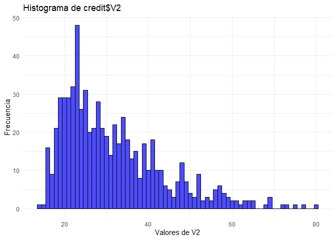<!-- -->

Esta variable podría representar facilmente la edad ya que sigue una
distribución normal en torno a los 20 años. También podría ser el dinero
que tiene,los ingresos, etc La edad podría ser importante en base a
tomar la decisión de aprobar el credito o no ya que los clientes jovenes
suelen tener mas riesgo, los clientes mayores suelen tener mas
estabilidad laboral, lo cual seria atractivo para largo plazo. También
tendría sentido que los clientes más mayores pidan menos creditos y la
longevidad es menor y el número de personas en rangos de edad avanzada
disminuye. También tiene sentido que los que más pidan sean clientes en
el rango de edad de entre los 20 y 40 por distintas razones como pedir
una hipotéca.

### V3

Continuando con V3, para analizar la distribución de valores comenzamos
realizando el histograma dado que es una variable numérica:


``` r
myhist = ggplot(data=na.omit(credit),aes(V3)) +
  geom_histogram(col="orange",fill="orange",alpha=0.2) + 
  labs(title="Histograma para V3", y="Count") 
myhist = myhist + geom_vline(xintercept = mean(credit$V3),
                             col="blue",linetype="dashed")
myhist = myhist + geom_vline(xintercept = median(credit$V3),
                             col="red",linetype="dashed")
myhist
```

```
## `stat_bin()` using `bins = 30`. Pick better value with `binwidth`.
```

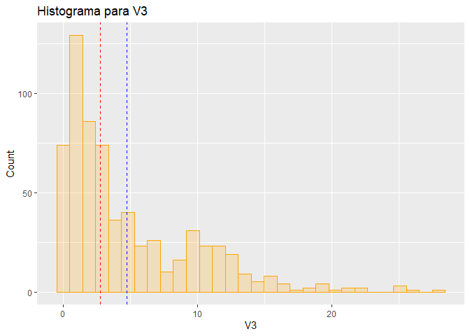<!-- -->

Como podemos ver hay una gran acumulación de valores en el rango [0-10],
encontramos varios valores superiores pero una baja proporción. Dada
esta distribución y viendo que no tenemos un rango de valores concreto
podríamos estar ante varias cosas: los ingresos del cliente, la deuda
del cliente, los años cotizados que tenga el cliente... Es complicado
decidirnos por una opción, por tanto hasta este punto del análisis nos
quedamos entre esas opciones.

### V4

La variable V4 se trata de un factor de 4 niveles como podemos ver a
continuación:


``` r
levels(credit$V4)
```

```
## [1] "l" "u" "y" "t"
```

En el contexto en el que estamos, esta variable podría ser varias cosas:
el sexo del cliente, si está en paro o no... Dado que es binaria. Para
descartar opciones vamos a hacer una tabla de proporciones a ver como se
distribuyen los valores.


``` r
prop.table(table(credit$V4))*100
```

```
## 
##          l          u          y          t 
##  0.2923977 75.8771930 23.8304094  0.0000000
```

Como podemos ver tenemos una clara tendencia al valor 'u'. Podría
deberse al estado civil. Descartamos la empleabilidad dado que un 30% de
personas que estén en paro le concedan un préstamo parece demasiado
alto. Al ser justo 4 valores nos cuadra que sea el estado civil, y que
los valores que pueda tomar sean:divorciado, casado, soltero y viudo.
Las razones por las que el banco guarda esto podría ser:

-   Estabilidad

-   Medir el riesgo

-   Predecir comportamientos

### V5

Continuando con V5, estamos ante un factor, por lo que vamos a ver sus
niveles:


``` r
levels(credit$V5)
```

```
## [1] "g"  "gg" "p"
```

Vemos que el factor tiene 3 niveles, podríamos estar ante el nivel de
estudios del cliente o el tipo de empleo que tiene (permanente,
temporal, desempleado)...

Vamos a ver como se reparten estos:


``` r
prop.table(table(credit$V5))
```

```
## 
##           g          gg           p 
## 0.758771930 0.002923977 0.238304094
```

Como podemos ver, el factor tiene 3 niveles pero realmente del valor
'gg' tiene una proporción muy baja por tanto podríamos sospechar de que
estamos realmente ante una variable binaria. Al igual que para las demás
variables binarias no podemos determinar el significado de esta variable
con exactitud.

### V6

Para comenzar con V6 analizamos sus factores:


``` r
levels(credit$V6)
```

```
##  [1] "aa" "c"  "cc" "d"  "e"  "ff" "i"  "j"  "k"  "m"  "q"  "r"  "w"  "x"
```

La variable V6 podría estar codificando el estilo de vida financiero del
cliente, es decir, si el cliente es ahorrador, conservador, inversor,
etc. También puede estar relacionada con nacionalidad de los clientes o
con el estado de residencia de estos, ya que la base de datos que
estamos tratando es la de un banco en Estados Unidos. Para tener una
mejor idea de lo que se refiere vamos a hacer una tabla de frecuencias.


``` r
prop.table(table(credit$V6))*100
```

```
## 
##         aa          c         cc          d          e         ff          i 
##  7.9295154 20.1174743  6.0205580  4.4052863  3.6710720  7.7826725  8.6637298 
##          j          k          m          q          r          w          x 
##  1.4684288  7.4889868  5.5800294 11.4537445  0.4405286  9.3979442  5.5800294
```

Ya que hay varios niveles y hay pocos porcentajes que sean altos , nos
quedamos con la idea de que V6 corresponde con los estados de residencia
de los clientes ya que esos porcentajes altos pueden corresponder a los
clientes que pertenecen al mismo estado que la sede de origen del banco
y a sus estados más próximos.

### V7

Respecto a V7, como estamos ante un factor vamos a ver sus niveles:


``` r
levels(credit$V7)
```

```
## [1] "bb" "dd" "ff" "h"  "j"  "n"  "o"  "v"  "z"
```

Como podemos ver, tenemos un factor con bastantes niveles por tanto
podríamos estar ante una clasificación por tipo de empleo o sector,
quizás también podría ser un identificador de la sucursal del banco en
la que se solicitó el préstamo...


``` r
prop.table(table(credit$V7))*100
```

```
## 
##         bb         dd         ff          h          j          n          o 
##  8.6637298  0.8810573  8.3700441 20.2643172  1.1747430  0.5873715  0.2936858 
##          v          z 
## 58.5903084  1.1747430
```

Observando la tabla de proporciones, podemos ver como la gran mayoría se
encuentra en la 'v' por tanto también podríamos estar ante una variable
que determine la nacionalidad del cliente dado que en gran parte estos
deben ser del mismo pais que el banco.

### V8

Para está variable, al ser numérica y al poder tomar cualquier valor, lo
analizamos en un histograma. Dado que los valores son pequeños, esta
variable podría representar los años que lleva trabajando, número de
transacciones...


``` r
ggplot(credit, aes(x = V8)) +
  geom_histogram(binwidth = 1, fill = "blue", color = "black", alpha = 0.7) +
  labs(title = "Histograma de credit$V8", x = "Valores de V8", y = "Frecuencia") +
  theme_minimal()
```

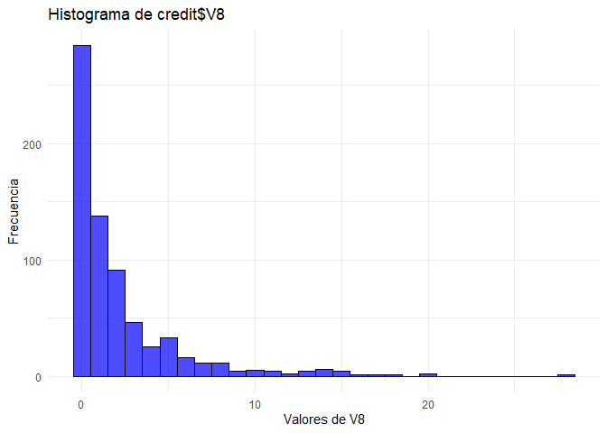<!-- -->

Si asumimos que es la experiencia laboral de los clientes, la mayoría de
ellos llevan muy poco tiempo, lo que podría suponer riesgo ya que tienen
menos estabilidad. Esto podría ayudar al banco para decidirse entre
darle el credito o no, ya que es un factor importante.

### V9

Procedemos con V9, estamos ante un factor por lo que comenzamos viendo
los niveles:


``` r
levels(credit$V9)
```

```
## [1] "f" "t"
```

Estamos ante un factor de 2 niveles de valores 't' y 'f' por tanto es
una variable booleana, podría tratarse de si es cliente del banco o no,
de si está casado o no...

No merece la pena ver la distribución de valores debido a que no es
posible determinar con exactitud cual de estas opciones podría ser o
incluso podría ser de otro tipo dado que hay multitud de opciones.

### V10

Comenzamos viendo los niveles del factor:


``` r
levels(credit$V10)
```

```
## [1] "f" "t"
```

Estamos ante una variable booleana por tanto vamos a analizar la tabla
de proporciones para ver si podemos decir saber algo más de esta


``` r
prop.table(table(credit$V10))*100
```

```
## 
##        f        t 
## 57.24638 42.75362
```

Viendo las proporciones, no podemos dejarnos influir por la letra en que
sea 'f' de false ya que podría estar codificado al revés para
confundirnos. De todos modos, con estas características poco podemos
decir de la variable, simplemente podemos dar opciones. Podría ser si
tienen un prestamo pendiente o no, aunque para ser esta variable no
encajaría con la variable que hemos estimado como la edad ya que la
mayor parte de los clientes serían jóvenes y es dudoso que tengan
préstamos pendientes antes de pedir uno. Otra opción es si tienen empleo
o no, pero esta opción es compleja de determinar, como cualquier otra,
con solamente estos datos.

### V11

Estamos ante una variable numérica por tanto vamos a ver el histograma
para ver la distribución de datos:


``` r
ggplot(credit, aes(x = V11)) +
  geom_histogram(bins = 30, fill = "skyblue", color = "black", alpha = 0.7) +
  labs(title = "Histograma de la Variable V11", x = "V11(original)", y = "Frecuencia") +
  theme_minimal()
```

<!-- -->

Observando el histograma, la variable V11 podría representar la cantidad
de veces que un solicitante ha tenido un retraso o incumplimiento de
pagos, debido a la alta frecuencia en 0 sugiere que muchos solicitantes
no tienen historial de impagos, mientras que quienes tienen valores más
altos tienen numerosos atrasos. También podríamos decir que se trata de
lo contrario, es decir, que se trata del número de préstamos ya pagados
o la puntuación que le adjunta el banco al cliente.

### V12

Esta variable es parecida a V1, ya que sus valores son bastante
parecidos. La variable puede tomar dos tipos de valores, ya que es
binaria.


``` r
levels(credit$V12)
```

```
## [1] "f" "t"
```


``` r
prop.table(table(credit$V12))*100
```

```
## 
##       f       t 
## 54.2029 45.7971
```

Los valores como se puede observar están bastante igualados.Como es una
variable booleana podría ser cualquier cosa, entonces no podemos decir
con exactitud a qué se refiere. Podría estar entre los opciones
comentadas en V1, como el sexo del cliente, si está en paro o no...

### V13

Estamos ante un factor por lo tanto vamos a ver los niveles de este


``` r
levels(credit$V13)
```

```
## [1] "g" "p" "s"
```

Tenemos un factor de tres niveles por lo que de nuevo es complicado
determinar que podría ser.

### V14

Esta variable es numérica por lo tanto, hacemos el histograma para poder
analizarlo mejor:


``` r
ggplot(credit, aes(x = V14)) +
  geom_histogram(binwidth = 14, fill = "blue", color = "black", alpha = 0.7) +
  labs(title = "Histograma de credit$V14", x = "Valores de V14", y = "Frecuencia") +
  theme_minimal()
```

```
## Warning: Removed 13 rows containing non-finite outside the scale range
## (`stat_bin()`).
```

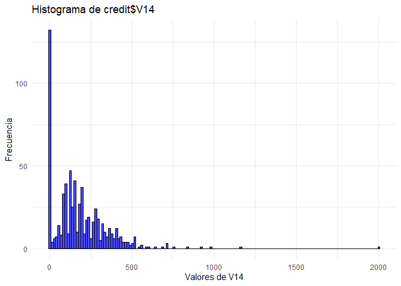<!-- -->

Como podemos ver, la mayoría de los valores se encuentran con
frecuencias altas, viendo este histograma y suponiendo el contexto de la
BBDD de un banco, podríamos suponer que esta variable se refiere a la
oficina en la que el cliente abrió su cuenta o quizás su código postal.
Los valores aislados que encontramos podría tratarse perfectamente de
ruido en los datos, esto lo analizaremos más adelante en la sección
correspondiente.

### V15

La variable es numérica por tanto vamos a ver como se distribuyen los
valores;


``` r
ggplot(credit, aes(x = V15)) +
  geom_histogram( fill = "blue", color = "black", alpha = 0.7) +
  labs(title = "Histograma de V15", x = "Valores de V15", y = "Frecuencia") +
  theme_minimal()
```

```
## `stat_bin()` using `bins = 30`. Pick better value with `binwidth`.
```

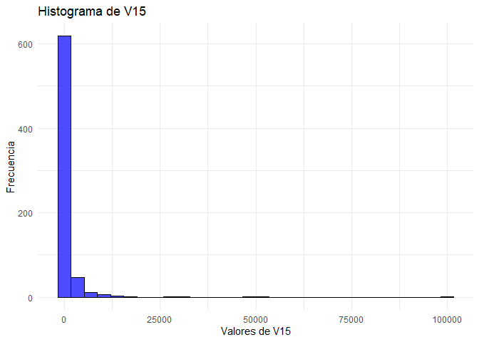<!-- -->

A juzgar por las cifras y la dispersión de valores,podríamos estar
claramente ante los ingresos de los clientes, es sin dudad la variable
con mayores cifras de las analizadas por tanto, esta opción tiene
sentido. Además, estos valores deben estar codificados en miles o alguna
otra unidad dado que la mayor parte de los valores se encuentra en
valores bajos y no tiene sentido que los clientes tengan tan bajos
ingresos.

### V16

Para comenzar vamos a ver los niveles ya que es un factor:


``` r
levels(credit$V16)
```

```
## [1] "-" "+"
```

Para esta variable, hay poco que comentar debido a que en la
documentación de la BBDD nos dice claramente que es la variable
objetivo, podemos intuir que un '+' significa aprobado y un '-'
significa denegado.

## Análisis univariable

### Análisis V2


``` r
summary(credit$V2)
```

```
##    Min. 1st Qu.  Median    Mean 3rd Qu.    Max.    NA's 
##   13.75   22.60   28.46   31.57   38.23   80.25      12
```

-   **Rango de valores**: La variable `V2` tiene un rango bastante
    amplio, con valores que van desde 13.75 hasta 80.25.

-   **Distribución de los datos**:

-   La **media** (31.57) está algo cerca de la **mediana** (28.46), lo
    que sugiere una distribución relativamente simétrica pero con una
    ligera tendencia hacia valores mayores, especialmente considerando
    que el máximo es bastante más alto que el tercer cuartil.

-   **Cuartiles**: La diferencia entre el primer cuartil (22.60) y el
    tercer cuartil (38.23) indica que el 50% intermedio de los valores
    de `V2` se encuentra en un rango moderado, entre 22.60 y 38.23.
    Posibles valores atípicos:

-   Dado que el máximo (80.25) está bastante alejado de la mediana
    (28.46) y del tercer cuartil (38.23), esto podría indicar la
    presencia de valores atípicos en el extremo superior de la
    distribución.

Para estar seguros de la distribución que sigue v2, creamos un
histograma de dicha variable:


``` r
myhist = ggplot(data = na.omit(credit), aes(V2)) +
  geom_histogram(binwidth = 0.5, col = "orange", fill = "orange", alpha = 0.2) + 
  labs(title = "Histograma para V2", y = "Count") +
  geom_vline(xintercept = mean(na.omit(credit$V2)), col = "blue", linetype = "dashed") +
  geom_vline(xintercept = median(na.omit(credit$V2)), col = "red", linetype = "dashed")

myhist
```

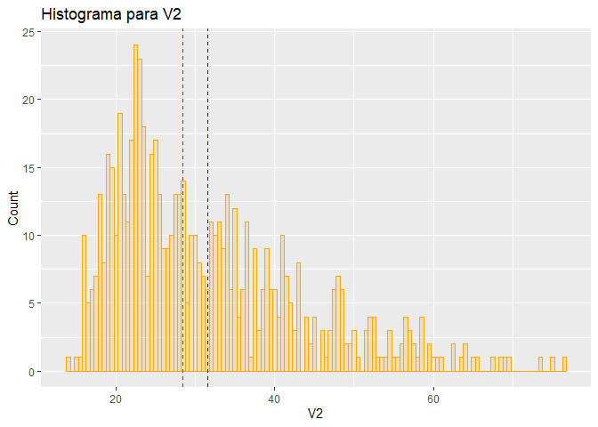<!-- -->

La distribución es **asimétrica a la derecha** o **sesgada
positivamente,** como se había inferido anteriormente. La mayoría de los
valores están en el rango bajo (de 15 a 40), y hay poca densidad en el
rango superior.

Hay algunos valores dispersos hacia la derecha que elevan el promedio,
lo que sugiere que existen **valores atípicos** o extremos en el extremo
superior.


``` r
myplot = ggplot(data=na.omit(credit),aes(sample=V2)) +
  ggtitle("QQ plot para V2") +
  geom_qq() + 
  stat_qq_line() + 
  xlab("Distribución teórica") + ylab("Distribución muestral")
myplot
```

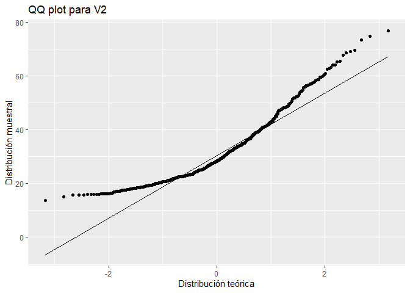<!-- -->

El gráfico Q-Q muestra cómo se distribuyen los datos en comparación con
una **distribución normal teórica**.

-   La curva de puntos se desvía hacia arriba en el extremo derecho, lo
    que confirma el **sesgo a la derecha** (positivamente sesgado). Los
    valores en el extremo superior no siguen la línea diagonal,
    indicando que hay algunos valores altos que se desvían de la
    normalidad.

-   La parte inferior del gráfico muestra algunos puntos ligeramente por
    debajo de la línea, lo que indica que la distribución no es
    perfectamente simétrica en esa zona, aunque el sesgo es más
    pronunciado hacia la derecha.

### Análisis de V3


``` r
summary(credit$V3)
```

```
##    Min. 1st Qu.  Median    Mean 3rd Qu.    Max. 
##   0.000   1.000   2.750   4.759   7.207  28.000
```

Características de nuestros datos:

-   La media de esta variable, como se puede observar 4.759, es mayor
    que la mediana, que es 2.750, lo que indica que es una distribución
    sesgada hacia la derecha (algunos de los valores que son mas altos
    están haciendo que la media aumente).

-   Los valores de esta variable se encuentran en un rango entre 0(min)
    y 28(max).

-   El primer cuartil(1) y el tercer cuartil(77.207) indican que la
    mayoría de los datos se encuentran entre esos valores. Respecto a
    los valores atipicos, se nota que existen ya que el valor mas alto
    que es 28 supera de forma significativa el tercer cuartil.

-   La mayoría de los datos de V3 parecen concentrarse en valores
    relativamente bajos, con unos pocos valores mucho mayores que
    podrían ser considerados outliers o valores extremos.

    Para confirmar los valores atípicos y como se distribuyen los datos
    en la variable representamos los valores en el histograma:


``` r
myhist=ggplot(data=credit, aes(x = V3)) +
  geom_histogram(col = "orange", fill = "orange", alpha = 0.2,
                 breaks = seq(0, 30, by = 1)) +
  labs(title = "Histograma para el análisis de la variable V3", y = "Count") 

# Marca el valor de la media con una línea azul vertical
myhist <- myhist + geom_vline(xintercept = mean(credit$V3),
                              col = "blue", linetype = "dashed")

# Marca el valor de la mediana con una línea roja vertical
myhist <- myhist + geom_vline(xintercept = median(credit$V3),
                              col = "red", linetype = "dashed")
myhist
```

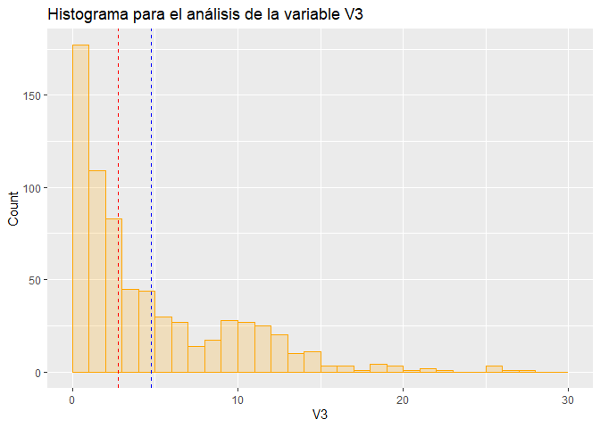<!-- -->

La mayoría de los valores están concentrados cerca de cero, lo que
indica que **V3** tiene una distribución sesgada hacia la izquierda
(sesgo positivo). Las barras más altas corresponden a los valores más
pequeños, mientras que los valores más grandes son menos frecuentes, lo
que sugiere que los datos contienen pocos valores extremos. Las líneas
verticales trazadas representan:

-   Media (línea azul): Ubicada ligeramente a la derecha de la moda,
    confirmando el sesgo positivo.

-   Mediana (línea roja): Cercana a la moda, pero ligeramente más baja
    que la media debido al impacto de los valores altos en el cálculo de
    la media.

Esta distribución sesgada podría requerir transformaciones como la
logarítmica si se utiliza en modelos sensibles al sesgo o para
normalizarla.

Para poder intuir si una muestra sigue una determinada distribución
estadística se pueden usar los diagramas del tipo Q−Q.


``` r
ggplot(credit, aes(sample = V3)) +
  stat_qq() +
  stat_qq_line(color = "blue", linetype = "dashed") +
  labs(title = "Diagrama Q-Q de V3", x = "Cuantiles Teóricos", y = "Cuantiles Muestrales")
```

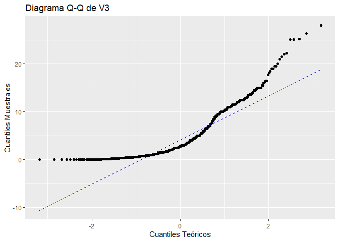<!-- -->

Los puntos en el gráfico no siguen la línea diagonal azul (que
representa la distribución normal), especialmente en los extremos
superior e inferior. Esto indica que la distribución de **V3** no es
normal, con una marcada desviación hacia valores extremos (sesgo
positivo), lo cual concuerda con el histograma observado anteriormente.

### Análisis V8


``` r
summary(credit$V8)
```

```
##    Min. 1st Qu.  Median    Mean 3rd Qu.    Max. 
##   0.000   0.165   1.000   2.223   2.625  28.500
```

Como podemos observar en el resumen de la variable, la media es bastante
superior a la mediana esto es debido a los valores atípicos, también lo
podemos observar en el valor máximo que es 28.50.

También podemos ver en los cuartiles como nos anuncian que hay muchos
datos atípicos ya que los cuartiles están cercanos a la media y a la
mediana pero el valor máximo es muy dispar.

Para poder ver como se distribuyen los datos en nuestra variable creamos
los siguientes plots:


``` r
myhist = ggplot(data=credit, aes(x = V8)) +
  geom_histogram(col="orange", fill="orange", alpha=0.2,
                 breaks=seq(0, 30, by=1)) + 
  labs(title="Histograma para el análisis de la variable V8", y="Count") 

# Marca el valor de la media con una línea azul vertical
myhist = myhist + geom_vline(xintercept = mean(credit$V8),
                             col="blue", linetype="dashed")

# Marca el valor de la mediana con una línea roja vertical
myhist = myhist + geom_vline(xintercept = median(credit$V8),
                             col="red", linetype="dashed")


# Mostrar el histograma
myhist
```

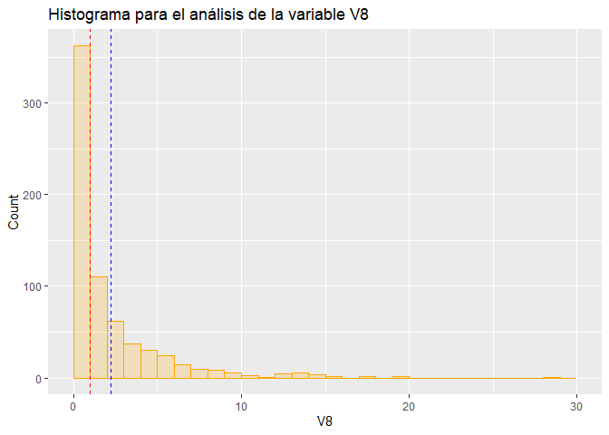<!-- -->


``` r
ggplot(data = credit, aes(sample = V8)) +
  ggtitle("QQ plot para variable V8") +
  stat_qq() + 
  stat_qq_line() +
  xlab("Distribución teórica") +
  ylab("Distribución muestral")
```

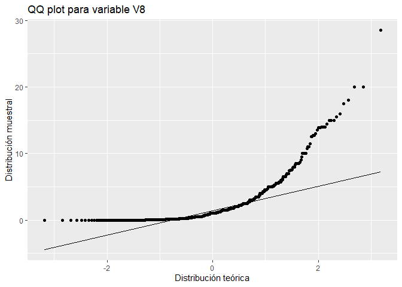<!-- -->

Como podemos observar en el histograma estamos ante una distribución
asimétrica positiva, sesgada a la derecha, ya que la mayor parte de los
datos se encuentran en valores más cercanos a 0 mientras que los valores
más altos son menos frecuentes.

Aunque la mayoría de los datos se encuentran en valores bajos, hay una
cola larga en el extremo derecho del histograma hasta valores cercanos a
30, estos valores atípicos sería necesario limpiarlos por que ensucian
la muestra.

El diagrama QQ nos reafirma lo analizado anteriormente mostrando
claramente como para valores más altos los datos se alejan de la
distribución teórica normal representada por la recta.

## Analisis multivariable


``` r
ggpairs(na.omit(credit), columns = c("V2", "V3", "V8","V14","V15", "V16")
,aes(color = V16, alpha = 0.6), title = "Análisis Multivariable de V2 V3 V8 V14 Y V15")
```

```
## `stat_bin()` using `bins = 30`. Pick better value with `binwidth`.
## `stat_bin()` using `bins = 30`. Pick better value with `binwidth`.
## `stat_bin()` using `bins = 30`. Pick better value with `binwidth`.
## `stat_bin()` using `bins = 30`. Pick better value with `binwidth`.
## `stat_bin()` using `bins = 30`. Pick better value with `binwidth`.
```

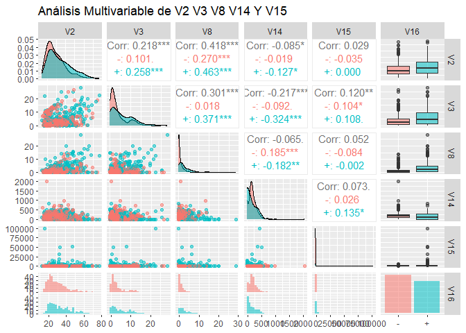<!-- -->

Se ha coloreado el gráfico mediante la variable categórica V16 la cual
determina si el crédito fue aprobado o no.

Las variables más útiles para el modelo pueden ser **V2, V8, y V3** ya
que parecen ser las más prometedoras, debido a que muestran ciertas
diferencias en la distribución de las clases de V16 y tienen
correlaciones moderadas entre sí.

Las variables potencialmente problemáticas son V14 y V15 ya que tienen
mucha dispersión y valores extremos, especialmente V15, lo cual podría
requerir tratamiento adicional, como transformación logarítmica o
normalización.

Las transformaciones sugeridas se deben al sesgo y la amplia escala en
V8, V14, y V15, estas variables podrían beneficiarse de una
transformación logarítmica o raíz cuadrada para reducir la dispersión y
mejorar su manejo en el modelo.

Este análisis multivariable sugiere que, para mejorar la interpretación
y el rendimiento del modelo, sería útil preprocesar **V8,y V15,** así
como priorizar **V2, V3, y V8** como variables predictoras principales.

# Pre-procesado de Datos (II): Tratamiento de outliers

Para continuar, vamos a comenzar con el tratamiento de valores atípicos.
Vamos a calcular el valor límite superior e inferior para considerarlos
atípicos. Vamos a repetir el cálculo con todas las variables numéricas
de la BBDD.

## Variable V2, V3 y V14


``` r
Q1=quantile(na.omit(credit$V2),0.25)
Q3=quantile(na.omit(credit$V2),0.75)
RIC=Q3-Q1
limiteInferior=Q1-1.5*RIC
limiteSuperior=Q3+1.5*RIC
atipicos=na.omit(credit$V2)[na.omit(credit$V2)<limiteInferior | na.omit(credit$V2)>limiteSuperior] 
percAtipicos=100*length(atipicos)/length((na.omit(credit$V2)))
print(paste("El porcentaje de datos atípicos para V2 es = ",percAtipicos))
```

```
## [1] "El porcentaje de datos atípicos para V2 es =  2.3598820058997"
```


``` r
Q1=quantile(na.omit(credit$V3),0.25)
Q3=quantile(na.omit(credit$V3),0.75)
RIC=Q3-Q1
limiteInferior=Q1-1.5*RIC
limiteSuperior=Q3+1.5*RIC
atipicos=na.omit(credit$V3)[na.omit(credit$V3)<limiteInferior | na.omit(credit$V3)>limiteSuperior] 
percAtipicos=100*length(atipicos)/length((na.omit(credit$V3)))
print(paste("El porcentaje de datos atípicos para V3 es = ",percAtipicos))
```

```
## [1] "El porcentaje de datos atípicos para V3 es =  2.46376811594203"
```


``` r
Q1=quantile(na.omit(credit$V14),0.25)
Q3=quantile(na.omit(credit$V14),0.75)
RIC=Q3-Q1
limiteInferior=Q1-1.5*RIC
limiteSuperior=Q3+1.5*RIC
atipicos=na.omit(credit$V14)[na.omit(credit$V14)<limiteInferior | na.omit(credit$V14)>limiteSuperior] 
percAtipicos=100*length(atipicos)/length((na.omit(credit$V14)))
print(paste("El porcentaje de datos atípicos para V14 es = ",percAtipicos))
```

```
## [1] "El porcentaje de datos atípicos para V14 es =  1.92023633677991"
```

Como podemos ver el porcentaje de valores atípicos es muy bajo. Por
ello, vamos a mantener los datos atípicos intactos para estas variables,
ya que no merece la pena tratarlos al ser un porcentaje tan pequeño,ya
que pueden representar variabilidad real y natural en los datos. En caso
de tratarlos, podríamos perder precisión e información valiosa necesaria
para el modelo que ayude a aprender sobre situaciones fuera de lo común.

## Variable V8


``` r
Q1=quantile(na.omit(credit$V8),0.25)
Q3=quantile(na.omit(credit$V8),0.75)
RIC=Q3-Q1
limiteInferior=Q1-1.5*RIC
limiteSuperior=Q3+1.5*RIC
atipicos=na.omit(credit$V8)[na.omit(credit$V8)<limiteInferior | na.omit(credit$V8)>limiteSuperior] 
percAtipicos=100*length(atipicos)/length((na.omit(credit$V8)))
print(paste("El porcentaje de datos atípicos es = ",percAtipicos))
```

```
## [1] "El porcentaje de datos atípicos es =  9.1304347826087"
```


``` r
ggplot(credit, aes(x = V8)) +
  geom_histogram(bins = 30, fill = "orange", color = "black", alpha = 0.7) +
  labs(title = "Histograma de V8 original", x = "V8 (original)", y = "Frecuencia")
```

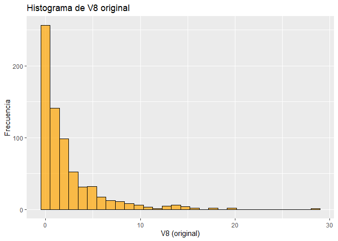<!-- -->

Viendo el histograma podemos comprobar que tenemos una distribución
sesgada a la derecha, con una larga cola de valores. La mayor
concetración de valores se encuenta entre el 0 y el 5, aproximadamente.
El resto de valores podrían ser considerados como $outliers$. Para
asegurarnos, realizamos el whisker plot:


``` r
ggplot(credit, aes(y = V8)) +
  geom_boxplot(fill = "skyblue", color = "darkblue", outlier.color = "red", outlier.shape = 16) +
  labs(title = "Boxplot de V8", y = "V8", x = "") +
  theme_minimal()
```

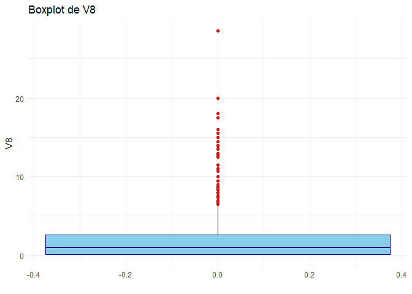<!-- -->

Confirmando lo dicho anteriormente, podemos ver como tenemos una gran
cantidad de valores fuera de rango por la parte superior del RIC. Este
tipo de distorsiones puede tener efectos bastante perjudiciales y puede
ser muy conveniente tratar estos posibles $outliers$, como veremos más
adelante.

## Variable V11


``` r
Q1=quantile(na.omit(credit$V11),0.25)
Q3=quantile(na.omit(credit$V11),0.75)
RIC=Q3-Q1
limiteInferior=Q1-1.5*RIC
limiteSuperior=Q3+1.5*RIC
atipicos=na.omit(credit$V11)[na.omit(credit$V11)<limiteInferior | na.omit(credit$V11)>limiteSuperior] 
percAtipicos=100*length(atipicos)/length((na.omit(credit$V11)))
print(paste("El porcentaje de datos atípicos es = ",percAtipicos))
```

```
## [1] "El porcentaje de datos atípicos es =  11.4492753623188"
```


``` r
ggplot(credit, aes(x = V11)) +
  geom_histogram(bins = 30, fill = "skyblue", color = "black", alpha = 0.7) +
  labs(title = "Histograma de la Variable V11", x = "V11(original)", y = "Frecuencia") +
  theme_minimal()
```

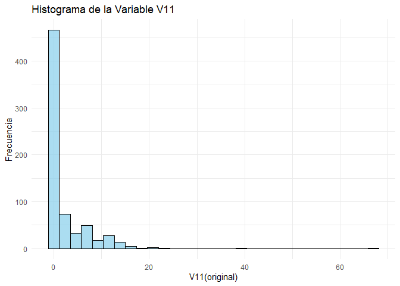<!-- -->

Como vemos, la mayor parte de valores se encuentran concentrados en
torno al 0. El histograma nos delata como hay bastantes valores fuera de
rango. Para confirmarlo vemos el whisker plot:


``` r
ggplot(credit, aes(y = V11)) +
  geom_boxplot(fill = "skyblue", color = "darkblue", outlier.color = "red", outlier.shape = 16) +
  labs(title = "Boxplot de V11", y = "V11", x = "") +
  theme_minimal()
```

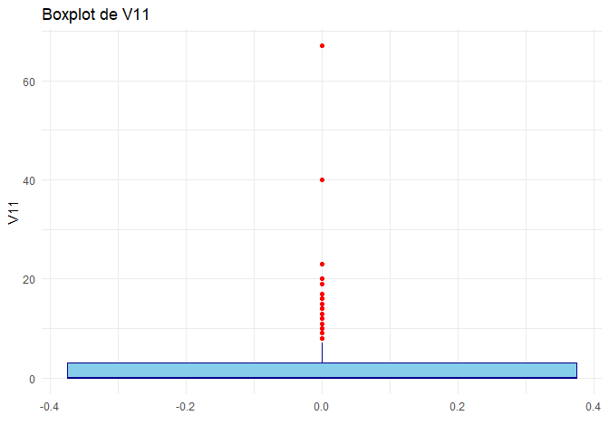<!-- -->

Confirmamos lo dicho anteriormente, podemos ver como hay muchisimos
valores fuera del RIC. Estos valores más adelante valoraremos su efecto
y el tratamiento que le daremos.

## Variable V15


``` r
Q1=quantile(na.omit(credit$V15),0.25)
Q3=quantile(na.omit(credit$V15),0.75)
RIC=Q3-Q1
limiteInferior=Q1-1.5*RIC
limiteSuperior=Q3+1.5*RIC
atipicos=na.omit(credit$V15)[na.omit(credit$V15)<limiteInferior | na.omit(credit$V15)>limiteSuperior] 
percAtipicos=100*length(atipicos)/length((na.omit(credit$V15)))
print(paste("El porcentaje de datos atípicos es = ",percAtipicos))
```

```
## [1] "El porcentaje de datos atípicos es =  16.3768115942029"
```


``` r
ggplot(credit, aes(x = V15)) +
  geom_histogram(bins = 30, fill = "skyblue", color = "black", alpha = 0.7) +
  labs(title = "Histograma de la Variable V15", x = "V15", y = "Frecuencia") +
  theme_minimal()
```

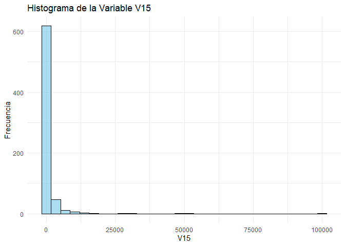<!-- -->

Al igual que con la variable anterior, la mayor concentración de valores
esta en torno al 0. Esto nos puede llevar a que las variables tengan una
cierta correlación como ya estudiaremos más adelante. Aqui aunque el
histograma parezca tener menos datos atípicos realmente es la variable
que más porcentaje tiene debido a su alta concentración en los valores
bajos.

Analizamos el whisker plot:


``` r
ggplot(credit, aes(y = V15)) +
  geom_boxplot(fill = "skyblue", color = "darkblue", outlier.color = "red", outlier.shape = 16) +
  labs(title = "Boxplot de V15", y = "V15", x = "") +
  theme_minimal()
```

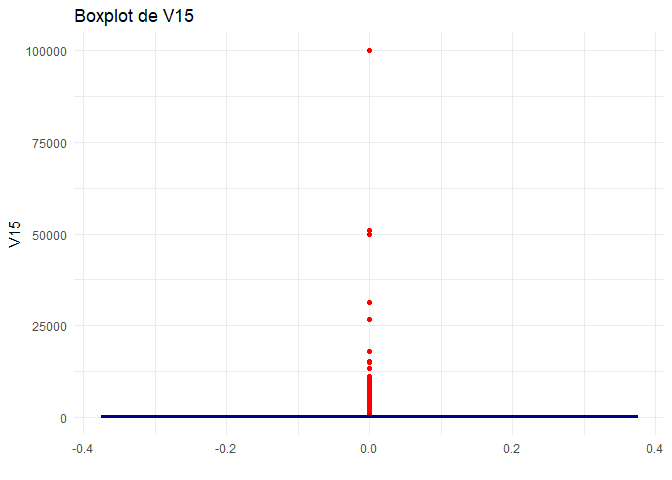<!-- -->

Como podemos ver, la caja que representa el RIC es muy fina debido a lo
que hemos comentado anteriormente, la alta concentración en torno al 0.
Este diagrama reafirma una vez más lo dicho anteriormente, y representa
la gran cantidad de $outliers$ que tiene esta variable. Más adelante se
tratarán estos valores.

# Dividiendo datos en Train/Test

Los datos de los que se dispone se deben dividir en dos conjuntos. Uno
para entrenar los modelos y otro para hacer una estimación del
rendimiento de los modelos entrenados con datos nunca vistos.

Es importante que el conjunto de test se mantenga apartado y no se
utilice la información que contiene para tomar decisiones sobre el
entrenamiento puesto que hacerlo implica reducir la generalización y
ensuciar el rendimiento real de los modelos, ya que al hacer $peeking$
el modelo ha visto los datos utilizados para evaluarlo obteniendo
mejores resultados de los que realmente debería.. Así que lo primero que
debemos hacer es dividir los datos y dejar de un lado los datos de test.


``` r
credit.trainIdx<-readRDS("credit.trainIdx")
credit.Datos.Train<-credit[credit.trainIdx,]
credit.Datos.Test<-credit[-credit.trainIdx,]
```

Después comprobamos que efectivamente, tenemos 553 observaciones tal y
como se dice en la especificación de la práctica.


``` r
nrow(credit.Datos.Train)
```

```
## [1] 553
```

# Pre-procesado de datos(III): Eliminar nulos, predictores correlados o de poca Varianza

Para tomar decisiones sobre el conjunto de datos, vamos a analizar
únicamente el conjunto de datos Train, aunque las decisiones tomadas se
aplicarán a los conjuntos Train y Test.

## Tratamiendo de valores nulos

### Variables numéricas

Antes de comenzar, para tomar medida de cuán serio es el problema de los
valores nulos, debemos contar los casos que tienen valores nulos, y lo
hacemos con $complete.cases()$.


``` r
nrow(credit.Datos.Train[!complete.cases(credit.Datos.Train),])
```

```
## [1] 37
```

Tenemos un total de 37 filas, de 553, aproximadamente un 4% de casos.
Esto es un porcentaje que conviene tratar. Aunque no es extremadamente
alto, tampoco es despreciable, y si no se maneja adecuadamente, podría
afectar la calidad del análisis y el rendimiento del modelo.

Antes de aplicar una solución a estos valores, vamos a realizar un
estudio de correlaciones. La idea es simple, si uno de los atributos con
valores nulos tiene una fuerte correlación con otro, podemos aprovechar
ese hecho para así generar sustitutos para los valores nulos, mediante
una técnica que introduce poco sesgo y sigue teniendo un bajo coste
computacional.


``` r
symnum(cor(credit.Datos.Train[, sapply(credit.Datos.Train, is.numeric)], use = "complete.obs"))
```

```
##     V2 V3 V8 V11 V14 V15
## V2  1                   
## V3     1                
## V8  .  .  1             
## V11       .  1          
## V14              1      
## V15                  1  
## attr(,"legend")
## [1] 0 ' ' 0.3 '.' 0.6 ',' 0.8 '+' 0.9 '*' 0.95 'B' 1
```

La matriz de correlación simbólica muestra que **no hay correlaciones
fuertes** entre las variables en este subconjunto. Dado que todas las
correlaciones son bajas, el método de imputación basado en correlación
podría no ser efectivo en este caso, ya que no hay ninguna variable que
esté claramente relacionada con otra.

En lugar de usar correlaciones, vamos a comprobar si sería posible
realizar la sustitución de variables numéricas mediante $medianImpute$
que consiste en reemplazar los valores nulos por la mediana de esa
variable.

Cabe destacar que no utlizamos el algoritmo de $Clustering Knn$ ya que
este algoritmo normaliza los datos y estamos limpiando los datos
desconocidos de todo el conjunto de datos de entrenamiento, por tanto,
no nos conviene normalizar los datos debido a que aún no sabemos que
modelos vamos a utilizar. Este proceso de ajuste de los datos será
llevado a cabo más adelante.

Sabiendo que tenemos valores NA en las columnas numéricas, vamos a
utilizar el comando de caret $preProcess()$ para generar un objeto que
nos permite modificar lo datos para facilitar el entrenamiento de
modelos. Veamos ahora los comandos para asignar los valores nulos o
missing usando $medianImpute$


``` r
preproc <- preProcess(credit.Datos.Train[, sapply(credit.Datos.Train, is.numeric)], method = "medianImpute")
credit_num_imputed <- predict(preproc, credit.Datos.Train[, sapply(credit.Datos.Train, is.numeric)])
sum(is.na(credit_num_imputed))
```

```
## [1] 0
```

Tras comprobar que el numero de valores NA es 0, comprobamos que nuestro
proceso ha tenido éxito.

### Variables Categóricas

Para las variables categóricas decidimos imputar valores nulos usando la
moda, se reemplazan los valores nulos con el valor más frecuente de esa
variable (moda). Esta técnica es sencilla, rápida y mantiene una
distribución similar a la original de los datos.


``` r
credit.Datos.Train[, sapply(credit.Datos.Train, is.numeric)] <- credit_num_imputed

imputar_moda <- function(x) {
  if (is.factor(x) || is.character(x)) {
    moda <- names(sort(table(x), decreasing = TRUE))[1]
    x[is.na(x)] <- moda
  }
  return(x)
}

credit.Datos.Train <- data.frame(lapply(credit.Datos.Train, imputar_moda))
nrow(credit.Datos.Train[!complete.cases(credit.Datos.Train),])
```

```
## [1] 0
```


``` r
credit.Datos.Train[!complete.cases(credit.Datos.Train),]
```

```
##  [1] V1  V2  V3  V4  V5  V6  V7  V8  V9  V10 V11 V12 V13 V14 V15 V16
## <0 rows> (o 0- extensión row.names)
```

El proceso ha tenido éxito, lo comprobamos ya que obtenemos que la base
de datos arreglada tiene 0 valores NA.

Ahora vamos a analizar los valores nulos en los datos de Test:


``` r
credit.Datos.Test[!complete.cases(credit.Datos.Test),]
```

```
##  [1] V1  V2  V3  V4  V5  V6  V7  V8  V9  V10 V11 V12 V13 V14 V15 V16
## <0 rows> (o 0- extensión row.names)
```

Como observamos no tenemos ningún valor nulo en este conjunto, por lo
realizamos ningún tratamiento.

## Eliminar variables con poca varianza

Que una variable tenga poca varianza indica que carece de mucha
información para crear distinciones entre los datos. Cuando
prácticamente todos los ejemplos son iguales en una característica,
dicha característica dice poco de la generalidad de los individuos. Por
tanto, vamos a proceder a identificar las variables que tienen escasa
varianza para ser eliminadas. Para llevar esto a cabo, utilizaremos la
función $nearZeroVar()$:


``` r
nearZeroVar(credit.Datos.Train)
```

```
## integer(0)
```

Como podemos ver, la funcion nos devuelve **0**, por tanto no tenemos
ninguna variable que encaje en estas características y deba ser
eliminada.

## Eliminar variables correladas


``` r
symnum(cor(credit.Datos.Train[, sapply(credit.Datos.Train, is.numeric)]))
```

```
##     V2 V3 V8 V11 V14 V15
## V2  1                   
## V3     1                
## V8  .  .  1             
## V11       .  1          
## V14              1      
## V15                  1  
## attr(,"legend")
## [1] 0 ' ' 0.3 '.' 0.6 ',' 0.8 '+' 0.9 '*' 0.95 'B' 1
```

Como podemos observar en el grafico, no existen variables númericas con
una alta correlación, por tanto no hay que tratar ninguna variable en
este punto del análisis.

# Pre-procesado de datos (IV): Transformando variables

## Preparando datos de entrenamiento y test para modelos que requieren normalización

### Variables con gran proporción de outliers

Para comenzar, vamos a realizar una normalización robusta para tratar
así los valores atípicos de las variables con alto porcentaje de
$outliers$, analizadas anteriormente.

El cambio de escala se aplica a las variables para normalizarlas y
ponerlas todas en una escala común. Esto se hace tanto para mejorar la
comprensión sobre su distribución y poder compararlas más fácilmente
evitando la distorsión de diferencia de escalas. De esta manera se
evitan problemas con los algorítmos de ajuste de modelos que no posean
la propiedad de invarianza al escalado.

Procedemos con la normalización.


``` r
credit.Datos.Train.Normalizados=credit.Datos.Train
preproc <- preProcess(credit.Datos.Train.Normalizados[, c("V8", "V11", "V15")], method = c("center", "scale"), 
                      center = apply(credit.Datos.Train[, c("V8", "V11", "V15")], 2, median), 
                      scale = apply(credit.Datos.Train[, c("V8", "V11", "V15")], 2, IQR))

credit.Datos.Train.Normalizados[, c("V8", "V11", "V15")] <- predict(preproc, credit.Datos.Train.Normalizados[, c("V8", "V11", "V15")])
head(credit.Datos.Train.Normalizados[, c("V8", "V11", "V15")])
```

```
##           V8        V11         V15
## 1 -0.2661186 -0.2854235 -0.18954660
## 2  0.4906544  0.5008241 -0.18902246
## 3 -0.1268724 -0.4819854 -0.18954660
## 4  0.1122679 -0.4819854 -0.18954660
## 5  1.3231046 -0.4819854  5.27630560
## 6 -0.6323967 -0.4819854  0.04613934
```

Como podemos comprobar, hemos aplicado la normalización correctamente.
El obtener valores negativos es completamente normal al aplicar este
tipo de normalización. Esto es debido a que la normalización robusta
consiste en centrar la variable en la mediana y escalar mediante el RIC.
Por tanto, los valores negativos significan que está el valor por debajo
de la mediana y los positivos que la supera.

### Variables con baja proporción de outliers

Como hemos analizado previamente, las variables **V2, V3 y V14**
presentan una distribución muy sesgada positivamente. Por lo tanto,
vamos a realizar una transformación logarítmica para conseguir así
reducir el sesgo y comprimir la larga cola de valores que arrastran las
distribuciones de las variables, además de mejorar la simetría de la
distribución.

Aplicamos la transformación logarítmica para las variables mencionadas.


``` r
credit.Datos.Train.Normalizados$V2=log1p(credit.Datos.Train.Normalizados$V2)
credit.Datos.Train.Normalizados$V3=log1p(credit.Datos.Train.Normalizados$V3)
credit.Datos.Train.Normalizados$V14=log1p(credit.Datos.Train.Normalizados$V14)
```

Después de aplicar la transformación logarítmica para reducir la
asimetría en los datos, procedemos a aplicar una normalización
adicional. La razón es que, aunque la transformación logarítmica reduce
la asimetría y comprime valores extremos, no garantiza que los datos
estén en un rango uniforme o en la escala adecuada para algunos modelos.

Procedemos a aplicar una normalización Min-Max dado que los modelos que
vamos a utilizar se benefician de la normalización. Aplicamos este
método ya que consideramos que es el más adecuado para los tipos de
variable que tenemos ya que mantienen la distribución original de los
datos, solo modifica su escalado.


``` r
min_max_normalize <- function(x) {
  return((x - min(x)) / (max(x) - min(x)))
}

credit.Datos.Train.Normalizados$V2=min_max_normalize(credit.Datos.Train.Normalizados$V2)
credit.Datos.Train.Normalizados$V3=min_max_normalize(credit.Datos.Train.Normalizados$V3)
credit.Datos.Train.Normalizados$V14=min_max_normalize(credit.Datos.Train.Normalizados$V14)
```

Ahora comprobamos que se ha realizado correctamente, ya que los valores
de encuentran entre 0 y 1.


``` r
summary(credit.Datos.Train.Normalizados[, c("V2", "V3", "V14")])
```

```
##        V2               V3              V14        
##  Min.   :0.0000   Min.   :0.0000   Min.   :0.0000  
##  1st Qu.:0.2730   1st Qu.:0.2058   1st Qu.:0.5781  
##  Median :0.3928   Median :0.3925   Median :0.6685  
##  Mean   :0.4230   Mean   :0.4153   Mean   :0.5553  
##  3rd Qu.:0.5508   3rd Qu.:0.6355   3rd Qu.:0.7380  
##  Max.   :1.0000   Max.   :1.0000   Max.   :1.0000
```

### Aplicando cambios a datos de test

A continuación, vamos a aplicar todos los cambios realizados a los datos
de test.


``` r
credit.Datos.Test.Normalizados=credit.Datos.Test
credit.Datos.Test.Normalizados$V2=log1p(credit.Datos.Test.Normalizados$V2)
credit.Datos.Test.Normalizados$V3=log1p(credit.Datos.Test.Normalizados$V3)
credit.Datos.Test.Normalizados$V14=log1p(credit.Datos.Test.Normalizados$V14)

credit.Datos.Test.Normalizados$V2=min_max_normalize(credit.Datos.Test.Normalizados$V2)
credit.Datos.Test.Normalizados$V3=min_max_normalize(credit.Datos.Test.Normalizados$V3)
credit.Datos.Test.Normalizados$V14=min_max_normalize(credit.Datos.Test.Normalizados$V14)
#Utilizamos la variable 'prepoc' creada anteriormente con los datos de TRAIN para evitar peeking
credit.Datos.Test.Normalizados[, c("V8", "V11", "V15")] <- predict(preproc, credit.Datos.Test.Normalizados[, c("V8", "V11", "V15")])
```

## Preparando datos de entrenamiento y test para Random Forest

Dado que Random Forest genera muchas ramas y combina predicciones de
árboles individuales, las variables irrelevantes o con poca información
pueden hacer que el modelo sea más lento o consuma más memoria.

Para analizar la contribución de cada variable en la predicción del
resultado final vamos a utilizar el modelo Ramdom Forest. Primeramente,
entrenamos el modelo con los datos que tenemos y posteriormente
revisamos la importancia de cada variable para analizar si hay alguna
candidata a eliminar.


``` r
predictors <- credit.Datos.Train[, -which(names(credit.Datos.Train) == "V16")]
target <- credit.Datos.Train$V16
rf_model <- randomForest(x = predictors, y = target, importance = TRUE)
importance_rf <- importance(rf_model)
varImpPlot(rf_model)
```

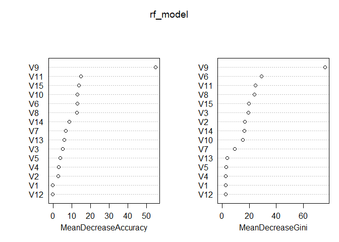<!-- -->

El diagrama de la izquierda muestra la importancia de cada variable en
la precisión del modelo (MeanDecreaseAccuracy). Este valor indica cuánto
disminuiría la precisión si eliminamos cada variable, ayudándonos a
identificar aquellas que son esenciales para mantener la capacidad
predictiva del modelo.

Por otro lado, el diagrama de la derecha muestra la importancia de cada
variable en la ganancia de información a través de la reducción del
índice de Gini (MeanDecreaseGini). Esta métrica refleja el impacto de
cada variable en la reducción de la impureza de los datos en los nodos
del árbol, lo cual es fundamental para la adquisición de conocimiento
por parte del modelo.

Analizando los resultados, podemos ver como hay variables que tienen
baja importancia en la precisión, sin embargo, estas mismas variables si
tienen importancia en la adquisición de conocimiento del modelo.Sin
embargo, V12,V1 y V4, son redundantes en ambas gráficas, por tanto
procedemos a eliminarlas.


``` r
credit.Datos.Train.Rf=credit.Datos.Train
credit.Datos.Train.Rf <- credit.Datos.Train.Rf[, !(names(credit.Datos.Train.Rf) %in% c("V1", "V12", "V4"))]
```

Para continuar, vamos a proceder a la reducción del sesgo de las
distintas variables dado que $ramdonForest$ se ve beneficiado mejorando
la interpretación de los datos.

Ya hemos analizado anteriormente las variables viendo que todas
presentan un sesgo positivo, para reducirlo aplicamos una transformación
logarítmica:


``` r
credit.Datos.Train.Rf$V2=log1p(credit.Datos.Train.Rf$V2)
credit.Datos.Train.Rf$V3=log1p(credit.Datos.Train.Rf$V3)
credit.Datos.Train.Rf$V8=log1p(credit.Datos.Train.Rf$V8)
credit.Datos.Train.Rf$V11=log1p(credit.Datos.Train.Rf$V11)
credit.Datos.Train.Rf$V14=log1p(credit.Datos.Train.Rf$V14)
credit.Datos.Train.Rf$V15=log1p(credit.Datos.Train.Rf$V15)
ggplot(credit.Datos.Train, aes(x = V2)) +
  geom_histogram(binwidth = 5, fill = "skyblue", color = "black") +
  labs(title = "Histograma de V2", x = "V2", y = "Frecuencia") +
  theme_minimal()
```

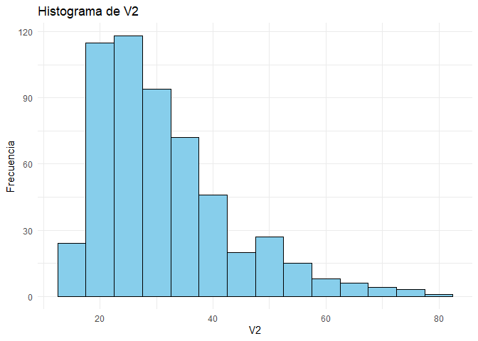<!-- -->

Como podemos ver, por ejemplo, en el histograma de la variable V2 se ha
corregido en gran medida el sesgo ganando algo de simetría, por tanto la
transformación se ha aplicado correctamente.

En cuanto a los outliers, debido a que estamos preparando los datos para
$randomForest$ no vamos a aplicar ningún tratamiento dado que este tipo
de algoritmos no se ven afectados por los datos atípicos y de tratarlos
podríamos capacidad de generalización en el modelo entrenado.

Aplicamos estos cambios a los datos de test:


``` r
credit.Datos.Test.Rf=credit.Datos.Test
credit.Datos.Test.Rf <- credit.Datos.Test.Rf[, !(names(credit.Datos.Test.Rf) %in% c("V1", "V12", "V4"))]
credit.Datos.Test.Rf$V2=log1p(credit.Datos.Test.Rf$V2)
credit.Datos.Test.Rf$V3=log1p(credit.Datos.Test.Rf$V3)
credit.Datos.Test.Rf$V8=log1p(credit.Datos.Test.Rf$V8)
credit.Datos.Test.Rf$V11=log1p(credit.Datos.Test.Rf$V11)
credit.Datos.Test.Rf$V14=log1p(credit.Datos.Test.Rf$V14)
credit.Datos.Test.Rf$V15=log1p(credit.Datos.Test.Rf$V15)
```

# Entrenando modelos

Para abordar esta sección del análisis vamos a dividirla en tantas
secciones como algoritmos de aprendizaje.

## Random Forest

Para comenzar, vamos a empezar entrenando el algorítmo que no necesita
noramlización.


``` r
set.seed(1234)

control <- trainControl(method = "cv", number = 10)

modelo_rf_cv <- train(
    V16 ~ .,
    data = credit.Datos.Train.Rf,
    method = "rf",
    trControl = control,
    tuneLength = 5
)
```

Al aplicar el set.seed, nos estamos asegurando de que los resultados
sean consistentes cada vez que se ejecuta el código.

Tambien hemos usado $cross-validation$, la cual divide los datos de
entrenamiento en 10 subconjuntos (pliegues) y entrena el modelo en 9 de
ellos y validandolo en la restante. Repitiendo el proceso 10 vveces, asi
commo indica el parámetro number.

La $cross-validation$ asegura que el modelo generaliza bien al evitar el
$overfitting$ y ofrece una estimación confiable.\
Este algoritmo construye múltiples árboles de decisión durante el
entrenamiento y combina sus predicciones para mejorar la precisión y
reducir el sobreajuste.

Random Forest es robusto y funciona bien en problemas con datos
complejos o con muchas variables.

El parámetro $tuneLength$ ajusta los hiperparámetros mediante búsqueda
en un espacio de 5 combinaciones posibles. En este caso el
hiperparámetro ajustable es $mtry$, el cual indica el numero de
predictores considerados al dividir nodos en cada árbol.


``` r
print(modelo_rf_cv)
```

```
## Random Forest 
## 
## 553 samples
##  12 predictor
##   2 classes: '-', '+' 
## 
## No pre-processing
## Resampling: Cross-Validated (10 fold) 
## Summary of sample sizes: 498, 499, 497, 497, 497, 498, ... 
## Resampling results across tuning parameters:
## 
##   mtry  Accuracy   Kappa    
##    2    0.8700253  0.7323281
##    9    0.8735666  0.7452971
##   17    0.8680123  0.7343778
##   25    0.8681433  0.7348916
##   33    0.8646392  0.7276932
## 
## Accuracy was used to select the optimal model using the largest value.
## The final value used for the model was mtry = 9.
```


``` r
predicciones <- predict(modelo_rf_cv, newdata = credit.Datos.Test.Rf)
confusionMatrix(predicciones, credit.Datos.Test.Rf$V16)
```

```
## Confusion Matrix and Statistics
## 
##           Reference
## Prediction  -  +
##          - 62  7
##          + 14 54
##                                           
##                Accuracy : 0.8467          
##                  95% CI : (0.7753, 0.9025)
##     No Information Rate : 0.5547          
##     P-Value [Acc > NIR] : 3.197e-13       
##                                           
##                   Kappa : 0.6932          
##                                           
##  Mcnemar's Test P-Value : 0.1904          
##                                           
##             Sensitivity : 0.8158          
##             Specificity : 0.8852          
##          Pos Pred Value : 0.8986          
##          Neg Pred Value : 0.7941          
##              Prevalence : 0.5547          
##          Detection Rate : 0.4526          
##    Detection Prevalence : 0.5036          
##       Balanced Accuracy : 0.8505          
##                                           
##        'Positive' Class : -               
## 
```

Los resultados muestran una precisión del 84.67% en el conjunto de test,
lo que indica un rendimiento sólido del modelo. La sensibilidad es del
81.58%, lo que refleja que el modelo identifica correctamente la mayoría
de los casos positivos, mientras que la especificidad es del 88.52%,
mostrando una buena capacidad para detectar negativos. El valor
predictivo positivo (PPV) es del 89.86%, y el valor predictivo negativo
(NPV) es del 79.41%, lo que confirma que las predicciones son confiables
en ambas clases. El índice Kappa de 0.6932 sugiere un acuerdo sustancial
entre las predicciones del modelo y los valores reales. El p-valor del
test de McNemar (0.1904) indica que no hay diferencias significativas
entre las tasas de error de las clases. Estos resultados validan que el
modelo tiene un buen equilibrio entre sensibilidad y especificidad,
logrando una precisión balanceada del 85.05%.

## Redes Neuronales


``` r
set.seed(1234)
modelo_nnet <- train(
    V16 ~ .,                           
    data = credit.Datos.Train.Normalizados,
    method = "nnet",
    trControl = control,
    tuneLength = 5,
    trace = FALSE
)
```


``` r
print(modelo_nnet)
```

```
## Neural Network 
## 
## 553 samples
##  15 predictor
##   2 classes: '-', '+' 
## 
## No pre-processing
## Resampling: Cross-Validated (10 fold) 
## Summary of sample sizes: 498, 499, 497, 497, 497, 498, ... 
## Resampling results across tuning parameters:
## 
##   size  decay  Accuracy   Kappa    
##   1     0e+00  0.8590139  0.7137698
##   1     1e-04  0.8427140  0.6820806
##   1     1e-03  0.8624579  0.7229277
##   1     1e-02  0.8480075  0.6927641
##   1     1e-01  0.8552477  0.7069905
##   3     0e+00  0.8371633  0.6714586
##   3     1e-04  0.8336556  0.6625385
##   3     1e-03  0.8229113  0.6386600
##   3     1e-02  0.8319721  0.6588632
##   3     1e-01  0.8447006  0.6828112
##   5     0e+00  0.8409632  0.6778613
##   5     1e-04  0.8283033  0.6533292
##   5     1e-03  0.7976852  0.5896776
##   5     1e-02  0.8208297  0.6361611
##   5     1e-01  0.8626539  0.7216255
##   7     0e+00  0.7830363  0.5584537
##   7     1e-04  0.8319721  0.6603619
##   7     1e-03  0.8263456  0.6475347
##   7     1e-02  0.8117051  0.6181264
##   7     1e-01  0.8553463  0.7074331
##   9     0e+00  0.7921657  0.5784831
##   9     1e-04  0.8137518  0.6229644
##   9     1e-03  0.8062494  0.6079010
##   9     1e-02  0.8190777  0.6343521
##   9     1e-01  0.8553812  0.7054211
## 
## Accuracy was used to select the optimal model using the largest value.
## The final values used for the model were size = 5 and decay = 0.1.
```

``` r
predicciones <- predict(modelo_nnet, credit.Datos.Test.Normalizados) 
confusionMatrix(predicciones, credit.Datos.Test$V16)
```

```
## Confusion Matrix and Statistics
## 
##           Reference
## Prediction  -  +
##          - 61  9
##          + 15 52
##                                           
##                Accuracy : 0.8248          
##                  95% CI : (0.7506, 0.8844)
##     No Information Rate : 0.5547          
##     P-Value [Acc > NIR] : 2.175e-11       
##                                           
##                   Kappa : 0.6488          
##                                           
##  Mcnemar's Test P-Value : 0.3074          
##                                           
##             Sensitivity : 0.8026          
##             Specificity : 0.8525          
##          Pos Pred Value : 0.8714          
##          Neg Pred Value : 0.7761          
##              Prevalence : 0.5547          
##          Detection Rate : 0.4453          
##    Detection Prevalence : 0.5109          
##       Balanced Accuracy : 0.8275          
##                                           
##        'Positive' Class : -               
## 
```

Los resultados muestran una precisión del 82.48% en el conjunto de test,
lo que indica un rendimiento aceptable del modelo. La sensibilidad es
del 80.26%, lo que refleja que el modelo identifica correctamente la
mayoría de los casos positivos, y la especificidad es del 85.25%, lo que
muestra una buena capacidad para detectar negativos. El valor predictivo
positivo (PPV) del 87.14% y el valor predictivo negativo (NPV) del
77.61% confirman que las predicciones son razonablemente confiables en
ambas clases. El índice Kappa de 0.6488 sugiere un acuerdo sustancial
entre predicciones y datos reales, y el p-valor del test de McNemar
(0.3074) indica que no hay diferencias significativas entre las tasas de
error de las clases. Estos resultados validan que el modelo tiene un
equilibrio aceptable entre sensibilidad y especificidad, logrando una
precisión balanceada del 82.75%.

Para continuar, vamos a analizar que hiperparámetros se pueden ajustar
en el modelo NNET. Para ello, ejecutamos el siguiente comando:


``` r
modelLookup(("nnet"))
```

```
##   model parameter         label forReg forClass probModel
## 1  nnet      size #Hidden Units   TRUE     TRUE      TRUE
## 2  nnet     decay  Weight Decay   TRUE     TRUE      TRUE
```

En el modelo nnet hemos ajustado dos hiperparámetros clave: size y
decay. El hiperparámetro size controla el número de nodos en la capa
oculta, lo que afecta la capacidad del modelo para capturar patrones
complejos; se probaron valores de 1, 3, 5 y 7, representando desde
configuraciones simples hasta arquitecturas más complejas. El
hiperparámetro decay es una tasa de regularización que ayuda a evitar el
sobreajuste al penalizar pesos grandes en la red; se exploraron valores
pequeños como 1e-05, 1e-04, 1e-03 y 1e-02 para encontrar un equilibrio
entre flexibilidad y generalización. Estas combinaciones fueron
evaluadas directamente en el conjunto de test, y la precisión se calculó
para cada configuración, almacenando los resultados para identificar la
mejor combinación de nodos y regularización.


``` r
  grid <- expand.grid(
    size = c(1, 3, 5, 7),              
    decay = c(1e-05, 1e-04, 1e-03, 1e-02) 
  )
  resultados <- data.frame(size = numeric(),
                           decay = numeric(),
                           precision_test = numeric())
  for (i in 1:nrow(grid)) {
    size <- grid$size[i]
    decay <- grid$decay[i]
    
    set.seed(123)
    modelo_nnet <- train(
      V16 ~ ., 
      data = credit.Datos.Train, 
      method = "nnet", 
      trControl = control,
      tuneGrid = expand.grid(size = size, decay = decay),
      trace = FALSE
    )
    predicciones <- predict(modelo_nnet, newdata = credit.Datos.Test)
    
   
    conf_matrix <- confusionMatrix(predicciones, credit.Datos.Test$V16)
    precision_test <- conf_matrix$overall["Accuracy"]  
    
   
    resultados <- rbind(resultados, data.frame(size = size, decay = decay, precision_test = precision_test))
  }
  
 
  resultados <- resultados[order(-resultados$precision_test), ]
  print(resultados)
```

```
##            size decay precision_test
## Accuracy10    5 1e-03      0.8759124
## Accuracy1     3 1e-05      0.8613139
## Accuracy15    7 1e-02      0.8540146
## Accuracy2     5 1e-05      0.8467153
## Accuracy11    7 1e-03      0.8467153
## Accuracy12    1 1e-02      0.8467153
## Accuracy3     7 1e-05      0.8394161
## Accuracy4     1 1e-04      0.8394161
## Accuracy9     3 1e-03      0.8321168
## Accuracy8     1 1e-03      0.8248175
## Accuracy14    5 1e-02      0.8248175
## Accuracy6     5 1e-04      0.8102190
## Accuracy7     7 1e-04      0.7518248
## Accuracy13    3 1e-02      0.7226277
## Accuracy      1 1e-05      0.7080292
## Accuracy5     3 1e-04      0.6788321
```

El bucle evalúa diferentes combinaciones de los hiperparámetros size
(nodos en la capa oculta) y decay (regularización) en el modelo nnet
para identificar la configuración que maximiza la precisión en el
conjunto de test. En cada iteración, el modelo se entrena con una
combinación específica de estos valores sin validación cruzada (method =
"none") y se evalúa directamente sobre el conjunto de test utilizando
una matriz de confusión para calcular la precisión. Los resultados, que
incluyen los valores de size, decay y la precisión obtenida, se
almacenan en un data frame y se ordenan para identificar fácilmente los
mejores hiperparámetros. Este enfoque permite controlar directamente el
rendimiento del modelo en datos no vistos y ajustar el balance entre su
flexibilidad y capacidad de generalización.


``` r
mejores_parametros <- resultados[1, ] 
size_mejor <- mejores_parametros$size
decay_mejor <- mejores_parametros$decay

set.seed(123)
nnet_tuned <- train(
  V16 ~ ., 
  data = credit.Datos.Train, 
  method = "nnet", 
  trControl = control,
  tuneGrid = expand.grid(size = size_mejor, decay = decay_mejor),
  trace = FALSE
)
predicciones_final <- predict(nnet_tuned, newdata = credit.Datos.Test)
confusionMatrix(predicciones_final, credit.Datos.Test$V16)
```

```
## Confusion Matrix and Statistics
## 
##           Reference
## Prediction  -  +
##          - 67  8
##          +  9 53
##                                          
##                Accuracy : 0.8759         
##                  95% CI : (0.8088, 0.926)
##     No Information Rate : 0.5547         
##     P-Value [Acc > NIR] : 5.29e-16       
##                                          
##                   Kappa : 0.7492         
##                                          
##  Mcnemar's Test P-Value : 1              
##                                          
##             Sensitivity : 0.8816         
##             Specificity : 0.8689         
##          Pos Pred Value : 0.8933         
##          Neg Pred Value : 0.8548         
##              Prevalence : 0.5547         
##          Detection Rate : 0.4891         
##    Detection Prevalence : 0.5474         
##       Balanced Accuracy : 0.8752         
##                                          
##        'Positive' Class : -              
## 
```

Los resultados muestran una precisión del 87.59% en el conjunto de test,
indicando un rendimiento sólido del modelo. La sensibilidad es del
88.16%, lo que refleja que el modelo identifica correctamente la mayoría
de los casos positivos, mientras que la especificidad es del 86.89%,
mostrando una buena capacidad para detectar negativos. El valor
predictivo positivo (PPV) del 89.33% y el valor predictivo negativo
(NPV) del 85.18% confirman que las predicciones son confiables en ambas
clases. El índice Kappa de 0.7492 sugiere un acuerdo sustancial entre
las predicciones del modelo y los valores reales. Además, el p-valor del
test de McNemar (1) indica que no hay diferencias significativas entre
las tasas de error de las clases. Estos resultados validan que el modelo
tiene un equilibrio adecuado entre sensibilidad y especificidad,
logrando una precisión balanceada del 87.52%.

## K-Nearest-Neighbors (KNN)


``` r
set.seed(1234)
knn_model <- train(
    V16 ~ .,                          
    data = credit.Datos.Train.Normalizados,
    method = "knn",
    trControl = control,
    tuneLength = 10                   
)
```


``` r
knn_predictions <- predict(knn_model, newdata = credit.Datos.Test.Normalizados)
confusionMatrix(knn_predictions, credit.Datos.Test.Normalizados$V16)
```

```
## Confusion Matrix and Statistics
## 
##           Reference
## Prediction  -  +
##          - 69  9
##          +  7 52
##                                           
##                Accuracy : 0.8832          
##                  95% CI : (0.8173, 0.9318)
##     No Information Rate : 0.5547          
##     P-Value [Acc > NIR] : <2e-16          
##                                           
##                   Kappa : 0.7628          
##                                           
##  Mcnemar's Test P-Value : 0.8026          
##                                           
##             Sensitivity : 0.9079          
##             Specificity : 0.8525          
##          Pos Pred Value : 0.8846          
##          Neg Pred Value : 0.8814          
##              Prevalence : 0.5547          
##          Detection Rate : 0.5036          
##    Detection Prevalence : 0.5693          
##       Balanced Accuracy : 0.8802          
##                                           
##        'Positive' Class : -               
## 
```

Los resultados del modelo **k-Nearest Neighbors (k-NN)** muestran una
precisión del 88.32% en el conjunto de test, indicando un rendimiento
robusto. La sensibilidad es del 90.79%, lo que refleja que el modelo
identifica correctamente la mayoría de los casos positivos, mientras que
la especificidad es del 85.25%, mostrando una buena capacidad para
detectar negativos. El valor predictivo positivo (PPV) es del 88.46%, y
el valor predictivo negativo (NPV) es del 88.14%, lo que confirma que
las predicciones son confiables en ambas clases. El índice Kappa de
0.7628 sugiere un acuerdo sustancial entre las predicciones del modelo y
los datos reales. Además, el p-valor del test de McNemar (0.8026) indica
que no hay diferencias significativas entre las tasas de error de las
clases. Estos resultados validan que el modelo tiene un excelente
balance entre sensibilidad y especificidad, logrando una precisión
balanceada del 88.02%. El mejor valor de hiperparámetro `k` encontrado
fue 5, lo que permite capturar una buena cantidad de vecinos cercanos
para la clasificación sin perder generalización.


``` r
plot(knn_model)
```

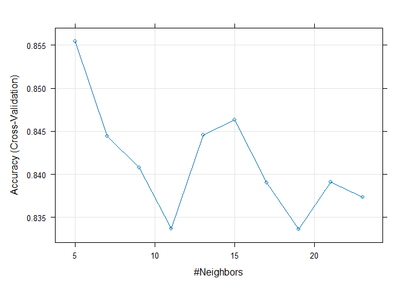<!-- -->

La gráfica muestra cómo cambia la precisión del modelo k-Nearest
Neighbors (k-NN) durante la validación cruzada al ajustar el número de
vecinos (k). La mayor precisión, cercana al 85.5%, se logra con k = 5,
lo que indica que considerar 5 vecinos logra un buen equilibrio entre
capturar patrones locales y generalizar correctamente. A medida que el
valor de k aumenta, la precisión disminuye, alcanzando mínimos en
valores como k = 11 y k = 19, lo que sugiere que considerar demasiados
vecinos diluye la influencia de los puntos más cercanos y relevantes.
Este comportamiento refleja que valores altos de k sobre-suavizan la
clasificación, mientras que valores bajos permiten identificar mejor las
características locales de los datos. En este caso, k = 5 resulta ser el
valor óptimo para el modelo.

## Gradient Boosting Machine (GBM)


``` r
set.seed(1234)
suppressWarnings({
gbm_model_original <- train(
    V16 ~ .,                       
    data = credit.Datos.Train.Normalizados,
    method = "gbm",
    trControl = control,
    tuneLength = 5,
    verbose = FALSE                
)})
```


``` r
print(gbm_model_original)
```

```
## Stochastic Gradient Boosting 
## 
## 553 samples
##  15 predictor
##   2 classes: '-', '+' 
## 
## No pre-processing
## Resampling: Cross-Validated (10 fold) 
## Summary of sample sizes: 498, 499, 497, 497, 497, 498, ... 
## Resampling results across tuning parameters:
## 
##   interaction.depth  n.trees  Accuracy   Kappa    
##   1                   50      0.8572006  0.7142332
##   1                  100      0.8537602  0.7049062
##   1                  150      0.8572655  0.7118742
##   1                  200      0.8610005  0.7184316
##   1                  250      0.8555459  0.7077638
##   2                   50      0.8519420  0.7012354
##   2                  100      0.8644420  0.7261871
##   2                  150      0.8609692  0.7196345
##   2                  200      0.8627537  0.7223531
##   2                  250      0.8627874  0.7223427
##   3                   50      0.8699615  0.7376368
##   3                  100      0.8753187  0.7478220
##   3                  150      0.8626551  0.7225905
##   3                  200      0.8572330  0.7116242
##   3                  250      0.8644084  0.7261353
##   4                   50      0.8680447  0.7339218
##   4                  100      0.8501239  0.6970747
##   4                  150      0.8537278  0.7038425
##   4                  200      0.8555471  0.7075658
##   4                  250      0.8627874  0.7223940
##   5                   50      0.8626563  0.7225478
##   5                  100      0.8644745  0.7260066
##   5                  150      0.8698966  0.7367459
##   5                  200      0.8662602  0.7287644
##   5                  250      0.8680784  0.7330831
## 
## Tuning parameter 'shrinkage' was held constant at a value of 0.1
## 
## Tuning parameter 'n.minobsinnode' was held constant at a value of 10
## Accuracy was used to select the optimal model using the largest value.
## The final values used for the model were n.trees = 100, interaction.depth =
##  3, shrinkage = 0.1 and n.minobsinnode = 10.
```

``` r
gbm_predictions <- predict(gbm_model_original, newdata = credit.Datos.Test.Normalizados)
confusionMatrix(gbm_predictions, credit.Datos.Test.Normalizados$V16)
```

```
## Confusion Matrix and Statistics
## 
##           Reference
## Prediction  -  +
##          - 60  5
##          + 16 56
##                                           
##                Accuracy : 0.8467          
##                  95% CI : (0.7753, 0.9025)
##     No Information Rate : 0.5547          
##     P-Value [Acc > NIR] : 3.197e-13       
##                                           
##                   Kappa : 0.6951          
##                                           
##  Mcnemar's Test P-Value : 0.0291          
##                                           
##             Sensitivity : 0.7895          
##             Specificity : 0.9180          
##          Pos Pred Value : 0.9231          
##          Neg Pred Value : 0.7778          
##              Prevalence : 0.5547          
##          Detection Rate : 0.4380          
##    Detection Prevalence : 0.4745          
##       Balanced Accuracy : 0.8538          
##                                           
##        'Positive' Class : -               
## 
```

El modelo tiene una precisión del 84.67%, lo que significa que predice
correctamente el 84.67% de los casos. La sensibilidad es del 78.95%,
indicando que identifica bien los negativos, mientras que la
especificidad es del 91.8%, reflejando una buena capacidad para detectar
positivos. El valor predictivo positivo es del 92.31%, lo que muestra
que la mayoría de las predicciones negativas son correctas, y el valor
predictivo negativo es del 77.78%, indicando que algunos positivos
predichos podrían no ser precisos. La métrica Kappa, de 0.6951, sugiere
un buen nivel de concordancia entre predicciones y valores reales.
Aunque los resultados son sólidos, la sensibilidad podría mejorarse para
equilibrar mejor las predicciones.

### Preprocesado para mejorar GBM

Para intentar mejorar los resultados obtenidos por GBM vamos a realizar
un nuevo preprocesado de manera experimental a ver que logramos obtener.

Para comenzar, vamos a eliminar las variables que el modelo considera
menos importantes


``` r
importancia_directa <- summary(gbm_model_original$finalModel)  
```

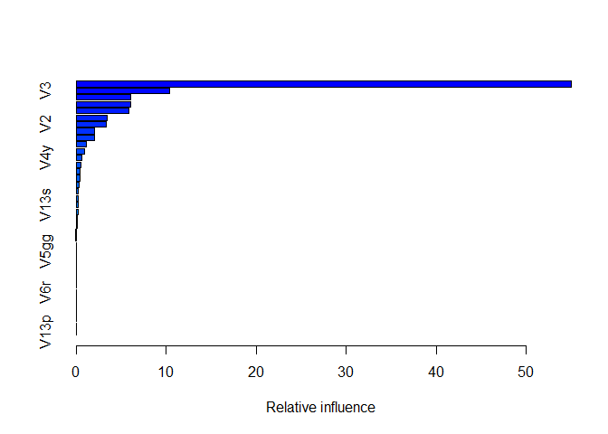<!-- -->

Como podemos ver, las variables V13, V6 y V4 son de una baja importancia
para el modelo, además, nos advertía de esto previamente con diferentes
$warning$ al entrenarlo, por lo que hemos tenido que poner
$suppressWarning$ por motivos de pulcridad de la salida.


``` r
credit.Datos.Train.gbm = credit.Datos.Train
credit.Datos.Test.gbm = credit.Datos.Test


credit.Datos.Train.gbm <- credit.Datos.Train.gbm[, !colnames(credit.Datos.Train.gbm) %in% c("V4", "V6", "V13")]
credit.Datos.Test.gbm <- credit.Datos.Test.gbm[, !colnames(credit.Datos.Test.gbm) %in% c("V4", "V6", "V13")]
```

Tras eliminar las variables, procedemos a hacer otra prueba de
entrenamiento para ver los resultados del modelo:


``` r
set.seed(1234)
suppressWarnings({
gbm_model <- train(
    V16 ~ .,                      
    data = credit.Datos.Train.gbm,
    method = "gbm",
    trControl = control,
    tuneLength = 5,
    verbose = FALSE              
)})
print(gbm_model)
```

```
## Stochastic Gradient Boosting 
## 
## 553 samples
##  12 predictor
##   2 classes: '-', '+' 
## 
## No pre-processing
## Resampling: Cross-Validated (10 fold) 
## Summary of sample sizes: 498, 499, 497, 497, 497, 498, ... 
## Resampling results across tuning parameters:
## 
##   interaction.depth  n.trees  Accuracy   Kappa    
##   1                   50      0.8553487  0.7109272
##   1                  100      0.8536616  0.7052645
##   1                  150      0.8553487  0.7087056
##   1                  200      0.8589202  0.7154525
##   1                  250      0.8446020  0.6860725
##   2                   50      0.8573329  0.7120750
##   2                  100      0.8589875  0.7159611
##   2                  150      0.8571681  0.7127502
##   2                  200      0.8554485  0.7088853
##   2                  250      0.8609355  0.7198301
##   3                   50      0.8645731  0.7268699
##   3                  100      0.8699303  0.7376420
##   3                  150      0.8626563  0.7234425
##   3                  200      0.8643759  0.7270921
##   3                  250      0.8626227  0.7234875
##   4                   50      0.8681445  0.7335792
##   4                  100      0.8645070  0.7260592
##   4                  150      0.8590849  0.7149257
##   4                  200      0.8645731  0.7267865
##   4                  250      0.8682756  0.7333523
##   5                   50      0.8680459  0.7336365
##   5                  100      0.8572342  0.7118652
##   5                  150      0.8590849  0.7156324
##   5                  200      0.8644408  0.7253834
##   5                  250      0.8590849  0.7142683
## 
## Tuning parameter 'shrinkage' was held constant at a value of 0.1
## 
## Tuning parameter 'n.minobsinnode' was held constant at a value of 10
## Accuracy was used to select the optimal model using the largest value.
## The final values used for the model were n.trees = 100, interaction.depth =
##  3, shrinkage = 0.1 and n.minobsinnode = 10.
```

``` r
gbm_predictions <- predict(gbm_model, newdata = credit.Datos.Test.gbm)

confusionMatrix(gbm_predictions, credit.Datos.Test.gbm$V16)
```

```
## Confusion Matrix and Statistics
## 
##           Reference
## Prediction  -  +
##          - 63  5
##          + 13 56
##                                           
##                Accuracy : 0.8686          
##                  95% CI : (0.8003, 0.9202)
##     No Information Rate : 0.5547          
##     P-Value [Acc > NIR] : 2.871e-15       
##                                           
##                   Kappa : 0.7374          
##                                           
##  Mcnemar's Test P-Value : 0.09896         
##                                           
##             Sensitivity : 0.8289          
##             Specificity : 0.9180          
##          Pos Pred Value : 0.9265          
##          Neg Pred Value : 0.8116          
##              Prevalence : 0.5547          
##          Detection Rate : 0.4599          
##    Detection Prevalence : 0.4964          
##       Balanced Accuracy : 0.8735          
##                                           
##        'Positive' Class : -               
## 
```

Como podemos ver, hemos mejorado tanto la precisión como la kappa. Para
intentar mejorarlo aún más vamos a proceder a aplicar otro tipo distinto
de normalización distinta al que ya habíamos probado anteriormente.
Vamos a realizar una normalización usando $preProcess$ de caret con el
metodo range:


``` r
preprocess <- preProcess(credit.Datos.Train.gbm, method = "range")
credit.Datos.Train.gbm.normalizado <- predict(preprocess, credit.Datos.Train.gbm)
credit.Datos.Test.gbm.normalizado <- predict(preprocess, credit.Datos.Test.gbm)
summary(credit.Datos.Test.gbm.normalizado)
```

```
##  V1           V2                V3           V5            V7    
##  a:43   Min.   :0.03128   Min.   :0.00000   g :100   v      :78  
##  b:94   1st Qu.:0.14286   1st Qu.:0.04464   gg:  0   h      :37  
##         Median :0.24316   Median :0.10714   p : 37   bb     :11  
##         Mean   :0.28297   Mean   :0.16466            ff     : 9  
##         3rd Qu.:0.40346   3rd Qu.:0.24107            j      : 1  
##         Max.   :0.81203   Max.   :0.90036            z      : 1  
##                                                      (Other): 0  
##        V8           V9     V10         V11          V12         V14         
##  Min.   :0.000000   f:60   f:76   Min.   :0.00000   f:75   Min.   :0.00000  
##  1st Qu.:0.008772   t:77   t:61   1st Qu.:0.00000   t:62   1st Qu.:0.03800  
##  Median :0.038070                 Median :0.00000          Median :0.08000  
##  Mean   :0.091368                 Mean   :0.03268          Mean   :0.09303  
##  3rd Qu.:0.122807                 3rd Qu.:0.02985          3rd Qu.:0.13600  
##  Max.   :0.526316                 Max.   :0.25373          Max.   :0.49000  
##                                                                             
##       V15           V16   
##  Min.   :0.000000   -:76  
##  1st Qu.:0.000000   +:61  
##  Median :0.000010         
##  Mean   :0.007448         
##  3rd Qu.:0.003000         
##  Max.   :0.151080         
## 
```

La normalización ha escalado correctamente las variables numéricas entre
0 y 1. Procedemos a volver a evaluar el modelo con esta nueva
transformación:


``` r
set.seed(1234)

gbm_model <- train(
    V16 ~ .,                         
    data = credit.Datos.Train.gbm.normalizado,
    method = "gbm",
    trControl = control,
    tuneLength = 5,
    verbose = FALSE              
    )
gbm_predictions <- predict(gbm_model, newdata = credit.Datos.Test.gbm.normalizado)
confusionMatrix(gbm_predictions, credit.Datos.Test.gbm.normalizado$V16)
```

```
## Confusion Matrix and Statistics
## 
##           Reference
## Prediction  -  +
##          - 63  5
##          + 13 56
##                                           
##                Accuracy : 0.8686          
##                  95% CI : (0.8003, 0.9202)
##     No Information Rate : 0.5547          
##     P-Value [Acc > NIR] : 2.871e-15       
##                                           
##                   Kappa : 0.7374          
##                                           
##  Mcnemar's Test P-Value : 0.09896         
##                                           
##             Sensitivity : 0.8289          
##             Specificity : 0.9180          
##          Pos Pred Value : 0.9265          
##          Neg Pred Value : 0.8116          
##              Prevalence : 0.5547          
##          Detection Rate : 0.4599          
##    Detection Prevalence : 0.4964          
##       Balanced Accuracy : 0.8735          
##                                           
##        'Positive' Class : -               
## 
```

Como vemos, esta transformación no ha mejorado el modelo, sino que se ha
mantenido todo igual tanto kappa con la precisión de clasificación. La
normalización no ha afectado el rendimiento del modelo GBM porque este
algoritmo no depende de la escala de las variables, ya que trabaja con
árboles de decisión que dividen los datos en función de umbrales. Aunque
no mejora directamente el modelo, puede ayudar a estabilizar cálculos
numéricos, facilitar la interpretación de las variables y preparar los
datos para combinar con otros algoritmos que sí sean sensibles a la
escala. En este caso, su impacto ha sido neutral porque GBM es robusto a
diferencias en la escala de las variables.

Podríamos probar a reducir el sesgo de las variables, sin embargo, la
reducción del sesgo no mejora el modelo GBM porque este algoritmo es
robusto a distribuciones sesgadas, ya que toma decisiones basadas en
divisiones por umbrales y no en la escala o forma de las variables.
Además, las transformaciones aplicadas podrían reducir la variabilidad
importante en las variables, afectando su capacidad predictiva. En este
caso, el rendimiento del modelo probablemente está limitado por otros
factores.

Por último, para intentar mejorar aún más el rendimiento con este
preprocesado vamos a intentar "tunear" los hiperparámetros a ver que
conseguimos obtener.

Para comenzar vamos a analizar los hiperparámetros que podemos
modificar:


``` r
modelLookup(("gbm"))
```

```
##   model         parameter                   label forReg forClass probModel
## 1   gbm           n.trees   # Boosting Iterations   TRUE     TRUE      TRUE
## 2   gbm interaction.depth          Max Tree Depth   TRUE     TRUE      TRUE
## 3   gbm         shrinkage               Shrinkage   TRUE     TRUE      TRUE
## 4   gbm    n.minobsinnode Min. Terminal Node Size   TRUE     TRUE      TRUE
```

Como observamos tenemos cuatro hiperpárametros disponibles para
configurar. Los cuatro hiperparámetros que podemos ajustar en el modelo
gbm son: **n.trees**, que define el número de iteraciones o árboles en
el proceso de boosting, lo que controla la complejidad y capacidad de
ajuste del modelo; **interaction.depth**, que establece la profundidad
máxima de cada árbol, determinando hasta qué punto el modelo puede
capturar interacciones complejas entre variables; **shrinkage**, también
conocido como tasa de aprendizaje, que reduce el impacto de cada árbol
en la predicción final, ayudando a evitar el sobreajuste y permitiendo
que el modelo aprenda de manera más gradual; y **n.minobsinnode**, que
especifica el número mínimo de observaciones requeridas en un nodo
terminal, lo cual ayuda a regular la complejidad de los árboles y reduce
el riesgo de sobreajuste ajustando la granularidad de las divisiones.
Estos parámetros nos permiten controlar la flexibilidad y precisión del
modelo.

Vamos a aplicar una **grid search** enfocada en buscar las combinaciones
de hiperparámetros cercanas a la elegida automáticamente por el modelo
para intentar conseguir mejor rendimiento.


``` r
tune_grid <- expand.grid(
  n.trees = c(90, 100, 110),          
  interaction.depth = c(2, 3, 4),      
  shrinkage = c(0.08, 0.1, 0.12),       
  n.minobsinnode = c(8, 10, 12)         
)

control <- trainControl(method = "cv", number = 10)   
set.seed(1234)
gbm_tuned <- train(
  V16 ~ ., 
  data = credit.Datos.Train.gbm.normalizado,
  method = "gbm",
  trControl = control,
  tuneGrid = tune_grid,
  verbose = FALSE
)

plot(gbm_tuned)
```

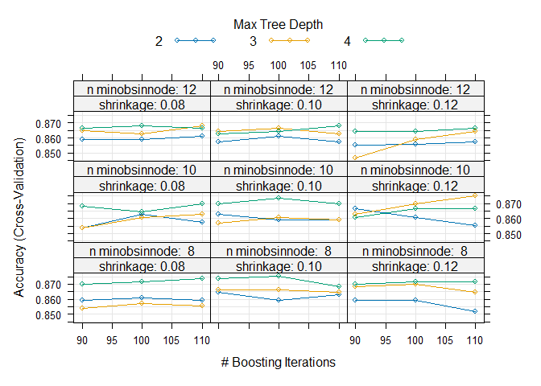<!-- -->

El número de iteraciones (\# Boosting Iterations), tasa de aprendizaje
(shrinkage), y número mínimo de observaciones por nodo (n.minobsinnode)
afectan la precisión del modelo en validación cruzada. Observamos que el
rendimiento es más consistente y alto para combinaciones con
interaction.depth = 4, shrinkage = 0.1, y n.minobsinnode = 8,
especialmente alrededor de 100 iteraciones. Esto sugiere que estas
configuraciones balancean bien la capacidad predictiva y la
generalización del modelo, mientras que ajustes más bajos en
interaction.depth o n.minobsinnode tienden a reducir la precisión.

Vamos a ver la precisión sobre el conjunto de test:


``` r
gbm_predictions <- predict(gbm_tuned, newdata = credit.Datos.Test.gbm.normalizado)
confusionMatrix(gbm_predictions, credit.Datos.Test.gbm.normalizado$V16)
```

```
## Confusion Matrix and Statistics
## 
##           Reference
## Prediction  -  +
##          - 65  6
##          + 11 55
##                                          
##                Accuracy : 0.8759         
##                  95% CI : (0.8088, 0.926)
##     No Information Rate : 0.5547         
##     P-Value [Acc > NIR] : 5.29e-16       
##                                          
##                   Kappa : 0.7508         
##                                          
##  Mcnemar's Test P-Value : 0.332          
##                                          
##             Sensitivity : 0.8553         
##             Specificity : 0.9016         
##          Pos Pred Value : 0.9155         
##          Neg Pred Value : 0.8333         
##              Prevalence : 0.5547         
##          Detection Rate : 0.4745         
##    Detection Prevalence : 0.5182         
##       Balanced Accuracy : 0.8785         
##                                          
##        'Positive' Class : -              
## 
```

Los resultados muestran una **precisión** del **87.59%** en el conjunto
de test, lo que indica un buen rendimiento del modelo. La sensibilidad
es del 85.53%, lo que refleja que el modelo identifica correctamente la
mayoría de los casos positivos, y la especificidad es del 90.16%, lo que
muestra una buena capacidad para detectar negativos. El valor predictivo
positivo (PPV) del 91.55% y el valor predictivo negativo (NPV) del
83.33% confirman que las predicciones son confiables en ambas clases. El
índice Kappa de 0.7508 sugiere un acuerdo sustancial entre predicciones
y datos reales, y el p-valor del test de McNemar (0.332) indica que no
hay diferencias significativas entre las tasas de error de las clases.
Estos resultados validan que el modelo tiene un buen equilibrio entre
sensibilidad y especificidad, logrando una precisión balanceada del
87.85%.

# Elección del modelo final

Para seleccionar el modelo final comenzaremos realizando una comparación
de todos los modelos entrenados.


``` r
resultados <- resamples(list(
  KNN = knn_model,
  GBM = gbm_model_original,
  GBM_tuned = gbm_tuned,
  NNET = modelo_nnet,
  NNET_tuned = nnet_tuned,
  RandomForest = modelo_rf_cv
))
```


``` r
bw_plot <- bwplot(resultados, metric = "Kappa", main = "Boxplot - Kappa") 
density_plot <- densityplot(resultados, metric = "Accuracy", main = "Density Plot - Accuracy") 
density_plot_kappa <- densityplot(resultados, metric = "Kappa", main = "Density Plot - Kappa") 
dot_plot <- dotplot(resultados, metric = "Accuracy", main = "Dotplot - Accuracy") 
gridExtra::grid.arrange(bw_plot, density_plot, ncol = 2)
```

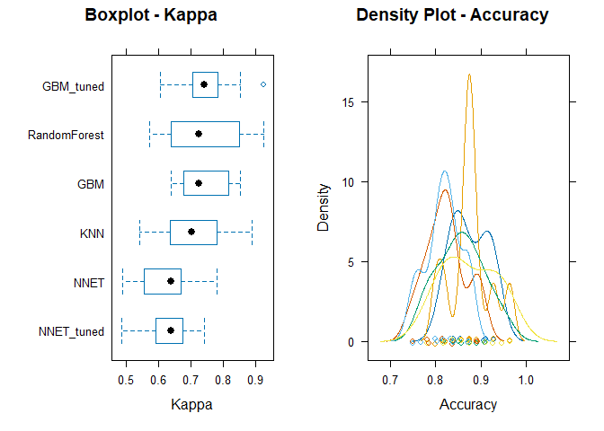<!-- -->


``` r
gridExtra::grid.arrange(density_plot_kappa, dot_plot, ncol = 2)
```

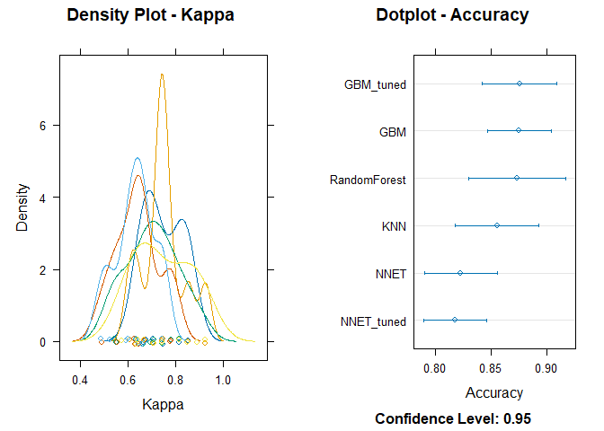<!-- -->

Las gráficas están comparando diferentes modelos usando métricas clave
como Kappa y Accuracy. En el Boxplot, se observa que los modelos GBM
ajustado y RandomForest tienen los valores más altos y consistentes de
Kappa, con una menor dispersión, lo que indica que estos modelos son más
confiables y robustos. Por otro lado, los modelos NNET y NNET ajustado
tienen una distribución más variable y valores de Kappa inferiores, lo
que sugiere un rendimiento menos estable en comparación con los modelos
anteriores.

En el Density Plot de Accuracy, las curvas confirman que el modelo GBM
ajustado tiene la densidad más concentrada hacia valores altos de
precisión, seguido de RandomForest y el modelo base de GBM. Esto implica
que estos modelos no solo tienen mejor rendimiento promedio, sino
también mayor consistencia entre las iteraciones. Los modelos como NNET
y su versión ajustada presentan distribuciones más dispersas, indicando
variabilidad en su precisión.

Finalmente, el Dotplot proporciona una comparación visual de la
precisión promedio con intervalos de confianza para cada modelo. El GBM
ajustado destaca con la mayor precisión promedio y un intervalo de
confianza estrecho, seguido de cerca por RandomForest. Esto refuerza que
estos dos modelos tienen un rendimiento confiable y generalizan mejor
los los datos. En resumen, los modelos GBM ajustado y RandomForest son
los más efectivos y consistentes en este análisis, mientras que los
demás modelos muestran un rendimiento aceptable pero menos competitivo.

## Conclusión

En conclusión, basándonos en los resultados obtenidos durante el
análisis y las pruebas realizadas, hemos seleccionado el modelo GBM
ajustado ($GBM_{tuned}$) como la mejor opción debido a su excelente
rendimiento y consistencia. Este modelo destacó en todas las métricas
evaluadas, mostrando un desempeño sólido y confiable. En el Dotplot,
$GBM_{tuned}$ obtuvo la mayor precisión promedio con un intervalo de
confianza reducido, lo que refuerza su estabilidad. Además, en los
Boxplots y Density Plots, presentó valores altos y concentrados tanto en
precisión como en Kappa, evidenciando su capacidad para generalizar
correctamente en distintos escenarios.

Aunque RandomForest también demostró ser un modelo competitivo con un
buen equilibrio entre sensibilidad y especificidad, $GBM_{tuned}$ superó
sus resultados, destacando por su capacidad de capturar patrones
complejos y generalizar mejor a datos no vistos. Gracias a su
rendimiento superior y menor variabilidad, $GBM_{tuned}$ se posiciona
como la solución más robusta y confiable para el problema planteado.
